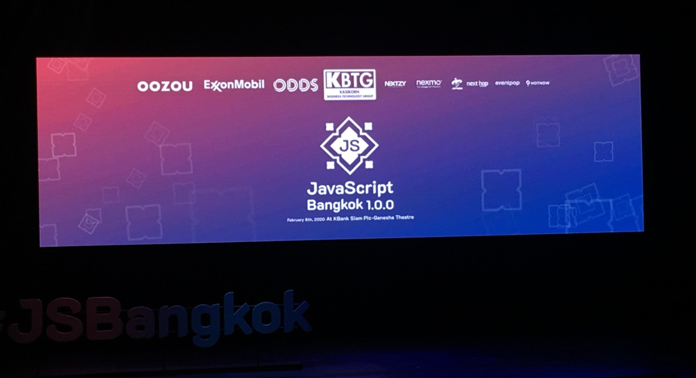
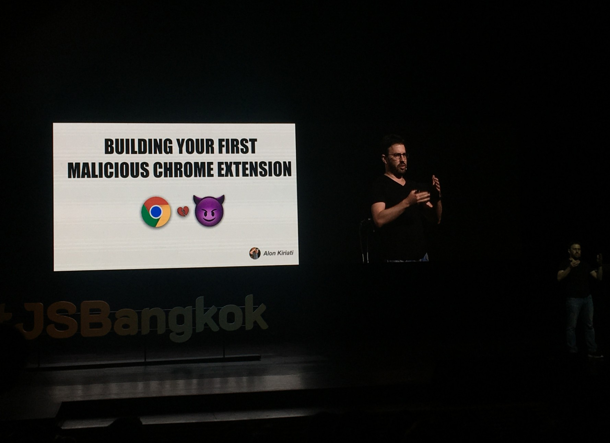

ผมมีโอกาสได้เข้าร่วมงาน [javascript bangkok 1.0.0](https://javascriptbangkok.com/) เมื่อวันที่ 8 กุมภาพันธ์ที่ผ่านมา ซึ่งถือเป็น tech event แห่งแรกที่ผมได้เข้าร่วมเลย ตอนแรกก็ลังเลว่าจะไปดีรึป่าว เพราะตัวผมเองยังใหม่มากเกี่ยวกับ javascript (ถึงแม้ว่าจะศึกษามานานแล้ว แต่ก็ลืมไปบ้างแล้ววว 555) แต่ว่า [armno](https://armno.in.th/) ก็บอกว่าไปเถอะ ไปร่วมงานกับเค้านั่นแหละ ซึ่งก็ถือว่าตัดสินใจถูกจริง ๆ เพราะว่าได้รับประสบการณ์ดีๆ เกี่ยวกับการร่วมงาน event แบบนี้ ได้เห็นว่าคนอื่น ๆ ที่มีประสบการณ์การทำงานในสาย web development ว่าเค้าใช้ tech stack กันแบบไหนบ้าง พบเจอปัญหาอะไรบ้างในหัวข้อนั้น ๆ Talk ทั้งหมดมีประมาณ 15 ข้อ (จาก Speaker ที่มาพูดนะครับ) มีที่ผมเข้าใจบ้าง ไม่เข้าใจบ้าง ก็ตามนั้นแหละครับ เพราะผมก็ยังไม่ได้ทำงานในด้านนี้เต็มตัว ผมคงไม่สรุปในเชิงความรู้ที่ได้รับนะครับ [ถ้าอยากได้สรุป ลองดูจาก link นี้ครับ คุณภูมิทำไว้ดีมาก ๆ](https://www.facebook.com/hashtag/%E0%B8%AA%E0%B8%A3%E0%B8%B8%E0%B8%9Bjavascriptbangkok?source=feed_text&epa=HASHTAG) ขอแบ่งปันประสบการณ์ที่ได้รับประมาณนี้

ราคาบัตร ผมจัดไปเกือบ ๆ 3 พัน คนทั่วไปอาจจะคิดว่าแพง แต่ของที่ได้กลับมาก็มีเยอะพอสมควรครับ ไม่ว่าจะเป็น เสื้อ แก้ว Mug สมุด ปากกา รวมๆ กับ Talk ที่ได้ฟังจาก Speaker หลายๆ ท่าน เกือบลืมมมม อาหารและเบียร์ตอน Networking party ด้วยก็ถือว่าคุ้มครับ

Talk ที่ชอบก็จะมี

- **Adventures with the Event Loop** ของคุณ [Erin Zimmer](https://ez.codes/) คือจริงๆแล้ว event loop ใน javascript มีความซับซ้อนมากว่าที่ผมเคยดูจากวิดีโอใน youtube พอสมควร มีการจัดการเกี่ยว animation api ใน browser ด้วย ส่วนตัวชอบ talk นี้มากที่สุด

- **DevTools, the CSS advocate in your browser** ของคุณ [Chen Hui Jing](https://www.chenhuijing.com/) CSS Dev tools ทำอะไรได้เยอะมากกกกก (ดันลืมถ่ายรูปมาาาา)

- **Building your first malicious chrome extension** ของคุณ [Alon Kiriati](https://www.linkedin.com/in/akiriati/) อันนี้แกบอกว่า chrome extension มันน่ากลัวกว่าที่เราคิดเยอะนะ ถ้า install ไม่ดูดี ๆ นี่ถึงขั้นโดนเก็บ key log ได้เลยทีเดียว

ที่เหลือฟังพอเข้าใจบ้าง แต่เก็บรายละเอียดไม่ได้มากเท่าไหร่ เพราะค่อนข้างจะ advanced พอสมควร หวังว่าปีถัด ๆ ไป จะเข้าใจได้มากขึ้น  

ก่อนกลับอย่างที่บอกไว้ตอนต้นว่ามี Networking Party สำหรับไว้ทำความรู้จัก พบปะพูดคุย ผมเองก็ดันนนไม่กล้าไปคุยกับใครอีก 555 แต่สุดท้ายก็เข้าไปทัก [คุณคริส](https://medium.com/@chrisza) 1 ใน speker วันนี้ ผมเองก็ไม่ได้คุยเรื่องที่พูดวันนี้ แต่เห็นแกทำงานเป็นระดับ senior ละ น่าจะมีประสบการณ์ในการรับคนเข้าทำงานมาบ้าง พอจะสรุปคำแนะนำจากแกได้คือ

- ตัวแกเองไม่ได้ดูว่าจบอะไรมาเลย อยู่ที่ว่าทำอะไรบ้างก่อนหน้านั้น

- ถึงแม้ว่าจะไม่มีประสบการณ์ในการสร้าง product จริง แต่ถ้าคุณเข้าใจและอธิบาย project หรือ codebase ของคุณได้ นั่นก็ถือว่าพอมีของ

- ควรจะเขียน code ให้ถูกต้องตามมาตรฐานที่คนอื่นใช้งานกัน ไม่ใช่ว่าต้องให้คนอื่นมาแก้อยู่ตลอดเวลา

ก็ประมาณนี้ครับสำหรับ [javascript bangkok 1.0.0](https://javascriptbangkok.com/) หวังว่าปีหน้า จะแชร์แต่ละ talk ที่ลงรายละเอียดมากกว่านี้นะครับ :)  

