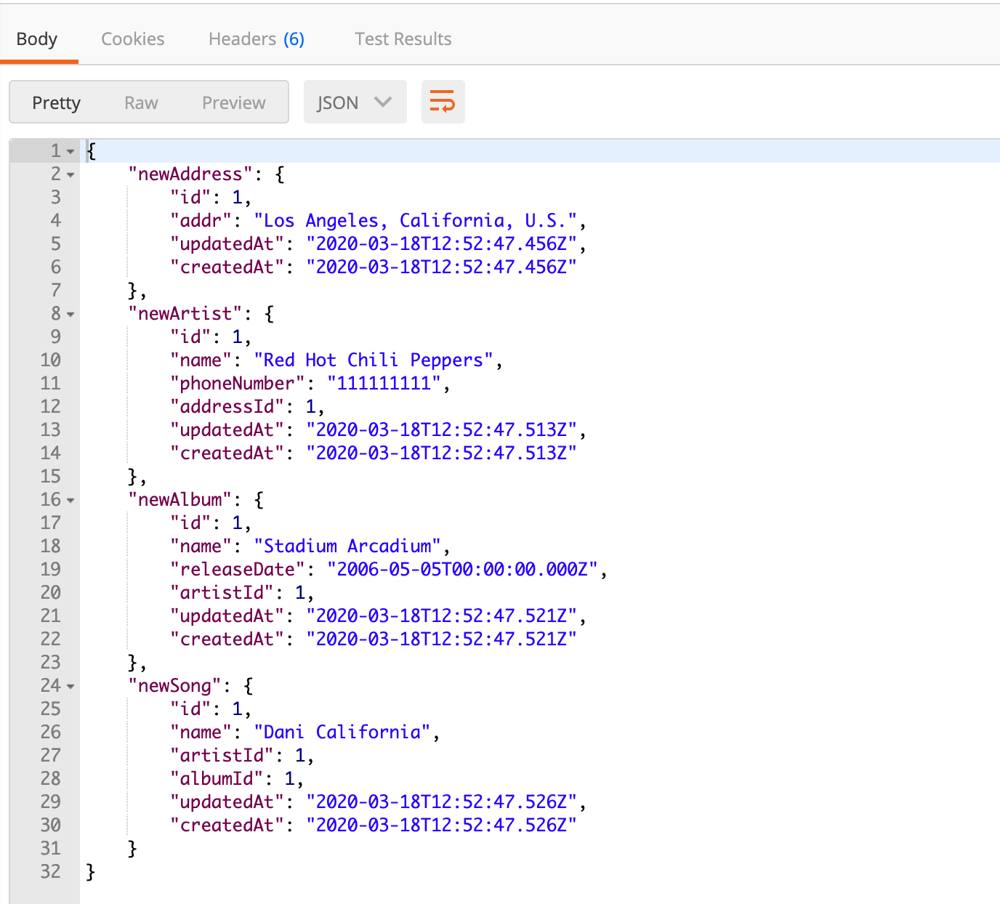

ต่อเนื่องจาก [blog ที่แล้วนะครับ](https://xeusteerapat.github.io/blog/node-sequelize-rest-api) ผมก็ได้เขียนเกี่ยวกับการทำงานระหว่าง Node.js กับ Sequelize.js ซึ่งเอาไว้จัดการกับ database แบบที่มี table เดียวแบบง่าย ๆ ว่าต้องทำเบื้องต้นอย่างไรบ้าง คราวนี้ผมจะลองเขียนกับ database ที่มีความซับซ้อนมากขึ้นอีกหน่อย โดยจะมี ER Diagram ดังรูปข้างล่างครับ


สำหรับท่านที่เซียนแล้วอาจจะเห็นว่าไม่เท่าไหร่ แต่ผมมือใหม่ไง 555555 ก็คิดว่ามันดูซับซ้อนแหละ อย่างน้อยก็เยอะกว่า blog ที่แล้ว ส่วนใครที่ยังงงเกี่ยว ER Diagram ก็ลองศึกษาเกี่ยวกับ database เบื้องต้นมาก่อนนะครับ ทีนี้เรามาลองไล่ดูความสัมพันธ์ของแต่ละ Entity โดยความสัมพันธ์แต่ละแบบจะเป็นตัวกำหนดว่า ฝั่งไหนจะเก็บ foreign key ของอีกฝั่ง

- Artist and Address เป็นแบบ **Many-to-One** ดังนั้น `addressId` ต้องเป็น foreign key ของ table `artist`
- Artist and Album เป็นแบบ **One-to-Many** ดังนั้น `artistId` ต้องเป็น foreign key ของ table `album`
- Album and Song เป็นแบบ **One-to-Many** ดังนั้น `albumId` ต้องเป็น foreign key ของ table `song`
- Artist and Song ป็นแบบ **One-to-Many** ดังนั้น `artistId` ต้องเป็น foreign key ของ table `song`
- Artist and Instrument เป็นแบบ **Many-to-Many** ดังนั้นต้องสร้าง table ขึ้นมาอีกอันนึง และเก็บค่าทั้ง `artistId` และ `instrumentId`
- Instrument and Song เป็นแบบ **Many-to-Many** ดังนั้นต้องสร้าง table ขึ้นมาอีกอันนึง และเก็บค่าทั้ง `instrumentId` และ `songId`

## Project setup

การติดตั้ง dependencies ต่าง ๆ ทำเหมือนกับ [blog ที่แล้ว](https://xeusteerapat.github.io/blog/node-sequelize-rest-api) แต่ทีนี้สิ่งที่ต่างกันก็จะเป็นในส่วนของ models ของเราครับ เพราะต้องมีไฟล์เพิ่มขึ้นมาตามตารางที่เพิ่มขึ้นครับ สร้างไฟล์ใน folder models ดังต่อไปนี้


### `address.js`

จากความสัมพันธ์พบว่ามีการเก็บค่า `addr` เพียงอย่างเดียว อ้อออ ผมลืมบอกไปว่า ถ้าเราใช้ sequelize มันจะสร้าง id ให้เราอัตโนมัติครับ เราไม่ต้องระบุลงไปใน models ดังนั้นก็จะได้ code ของ `address.js` แบบนี้

```javascript
module.exports = (sequelize, DataTypes) => {
  let address = sequelize.define('address', {
    addr: { type: DataTypes.STRING }
  });

  address.associate = models => {
    address.hasMany(models.artist);
  };

  return address;
};
```

สิ่งที่แตกต่างจาก blog ก่อนนหน้านี้ ก็คือเราต้องทำการระบุด้วยว่า `address` มีความสัมพันธ์กับตารางอื่นอย่างไรบ้าง ถ้าเลื่อนขึ้นไปดูข้างบนที่ผมอธิบายไว้ว่า Artist and Address เป็นแบบ **Many-to-One** ดังนั้น ก็จะได้เป็น `address.hasMany(models.artist)`

### `artist.js`

จาก ER เราจะเห็น artist มีความเกี่ยวข้องกับหลาย entity มาก เมื่อเราทำการ define models ก็จะได้ออกมาเป็นแบบนี้

```javascript
module.exports = (sequelize, DataTypes) => {
  let artist = sequelize.define('artist', {
    name: {
      type: DataTypes.STRING(100)
    },
    phoneNumber: {
      type: DataTypes.STRING(10)
    }
  });

  artist.associate = models => {
    artist.belongsTo(models.address);
    artist.hasMany(models.song);
    artist.hasMany(models.album);
    artist.belongsToMany(models.instrument, { through: models.play });
  };

  return artist;
};
```

จาก syntax ก็เห็นว่าค่อนข้างตรงไปตรงมากับความสัมพันธที่อธิบายไว้ข้างต้นนะครับ โดยที่ถ้าเป็น Many-to-Many ก็จะมีการเพิ่มตารางขึ้นมา `{ through: models.play }`

### `album.js`

Album มีเอี่ยวกับ Artist และ Song ก็จะเขียนได้เป็นแบบนี้

```javascript
module.exports = (sequelize, DataTypes) => {
  let album = sequelize.define('album', {
    name: {
      type: DataTypes.STRING(100)
    },
    releaseDate: {
      type: DataTypes.DATE
    }
  });

  album.associate = models => {
    album.hasMany(models.song);
    album.belongsTo(models.artist);
  };

  return album;
};
```

### `instrument.js`

instrument มีความสัมพันธ์เป็นแบบ Many-to-Many กับทั้ง Artist และ Song ดังนั้นก็จะเขียนได้เป็น

```javascript
module.exports = (sequelize, DataTypes) => {
  let instrument = sequelize.define('instrument', {
    name: {
      type: DataTypes.STRING(100)
    }
  });

  instrument.associate = models => {
    instrument.belongsToMany(models.artist, { through: models.play });
    instrument.belongsToMany(models.song, { through: 'InstrumentSong' });
  };

  return instrument;
};
```

### `song.js`

ความสัมพันธ์ของ Song กับตัวอื่นๆ มีทั้ง Many-to-One และ Many-to-Many เราจะ define model ของ song ได้เป็นแบบนี้

```javascript
module.exports = (sequelize, DataTypes) => {
  let song = sequelize.define('song', {
    name: {
      type: DataTypes.STRING(100)
    }
  });

  song.associate = models => {
    song.belongsTo(models.artist);
    song.belongsTo(models.album);
    song.belongsToMany(models.instrument, { through: 'InstrumentSong' });
  };

  return song;
};
```

โดยเราต้องเพิ่ม table ที่เพิ่มเข้ามาเพื่อเชื่อมความสัมพันธ์ระหว่าง instrument เพราะเป็นแบบ Many-to-Many ผมตั้งชื่อว่า InstrumentSong ละกัน

### `play.js`

เป็น table ของความสัมพันธ์ระหว่าง Artist และ Instrument โดยที่เก็บค่า minute code ก็จะได้แบบนี้

```javascript
module.exports = (sequelize, DataTypes) => {
  let play = sequelize.define('play', {
    minute: { type: DataTypes.INTEGER }
  });
  return play;
};
```

## Create Database

ทีนี้ทำการสร้าง database โดยใช้คำสั่ง

```bash
sequelize db:create
```

## Create Express server

สร้าง Express server แบบเดียวกันกับครั้งก่อนเลยครับ

```javascript
const express = require('express');
const bodyParser = require('body-parser');
const app = express();
const db = require('./models');

app.use(bodyParser.json());
app.use(bodyParser.urlencoded({ extended: false }));

db.sequelize.sync().then(() => {
  app.listen(4000, () => {
    console.log('Server listening on port 4000...');
  });
});
```

แล้วก็ start server ที่ terminal ด้วยคำสั่ง

```bash
npm run dev
```

## Create new Entity

เมื่อทุกอย่างเรียบร้อยแล้ว ทีนี้ก็มาถึงขั้นตอนการเพิ่มข้อมูลต่าง ๆ ลงไปในฐานข้อมูลบ้างนะครับ สังเกตได้ว่า Entity set ของเรามีความสัมพันธ์กันหลายรูปแบบมาก ถ้าเราไม่อัพเดทให้ถูกต้องตามขั้นตอน เราจะไม่สามารถสร้างข้อมูลลง database ได้ครับ หลักการสำคัญก็คือ **_ต้องเพิ่มข้อมูลลงใน table ที่ไม่มี foreign key อยู่ เป็นลำดับแรก_** ซึ่งถ้าเราย้อนกลับไปดูใน ER Diagram พร้อมกับความสัมพันธ์ของแต่ละ entity set จะพบว่า **address** ไม่มี foreign key ที่มาจาก table อื่นอยู่เลย ดังนั้นเราต้องทำการเริ่มจาก address ก่อนครับ แต่ละขั้นตอน ผมจะอธิบายเป็นขั้นตอนดังนี้นะครับ

- Create `newAddress` ภายใน table เราจะได้ `addressId` เพื่อที่จะนำไปใส่ใน table `artist`
- Create `newArtist` เราก็จะได้ `artistId` เพื่อที่จะนำไปใส่ใน table `album` และ `song`
- Create `newAlbum` เราจะได้ `albumId` เพื่อที่จะนำไปใส่ใน table `song`
- Create `newSong` โดยนำ id ของทั้ง `artist` และ `album` มาเก็บไว้

Code ใน express server ก็จะได้แบบนี้

```javascript
const express = require('express');
const bodyParser = require('body-parser');
const app = express();
const db = require('./models');

app.use(bodyParser.json());
app.use(bodyParser.urlencoded({ extended: true }));

app.post('/add-artist', async (req, res) => {
  const newAddress = await db.address.create({ addr: req.body.addr });

  const newArtist = await db.artist.create({
    name: req.body.name,
    phoneNumber: req.body.phoneNumber,
    addressId: newAddress.id // ได้มาจากการ create new address
  });

  const newAlbum = await db.album.create({
    name: req.body.name,
    releaseDate: req.body.releaseDate,
    artistId: newArtist.id // ได้มาจากการ create new artist
  });

  const newSong = await db.song.create({
    name: req.body.name,
    name: req.body.song.name,
    artistId: newArtist.id, // ได้มาจากการ create new artist
    albumId: newAlbum.id // ได้มาจากการ create new album
  });
  res.status(201).send({ newAddress, newArtist, newAlbum, newSong });
});

db.sequelize.sync().then(() => {
  app.listen(4000, () => {
    console.log('Server listening on port 4000...');
  });
});
```

## API Testing with Postman

เราก็จะทำการ test API ด้วย Postman เหมือนเดิม แต่ทีนี้จะใช้การเพิ่มข้อมูลแบบ raw data อ้อออ แล้วก็ตรง `bodyParser.urlencoded` ต้องเปลี่ยนเป็น `extended: true` เพราะว่าเราต้องทำการ nested ข้อมูลด้วย หน้าตาประมาณนี้นะครับ

```json
{
  "name": "Red Hot Chili Peppers",
  "phoneNumber": "111111111",
  "addr": "Los Angeles, California, U.S.",
  "album": {
    "name": "Stadium Arcadium",
    "releaseDate": "2006-05-05"
  },
  "song": {
    "name": "Dani California"
  }
}
```

ใน Postman


ผลลัพธ์ที่ได้จากทำการ post request



จะเห็นมีการนำเอา id ของแต่ละ table ที่มีความสัมพันธ์กันมาใช้อย่างเป็นลำดับขั้นตอน

Blog นี้ก็ขอจบเพียงเท่านี้ก่อนนะครับ blog หน้าอาจจะมาเขียนเพิ่มเติมเกี่ยวกับการ query data ออกมาโดยใช้ method ต่างๆ ครับ อ้อออออ [Repo](https://github.com/xeusteerapat/node-sequelize-complex-relational) อยู่ตรงนี้นะครับบบ

Happy Coding :)
