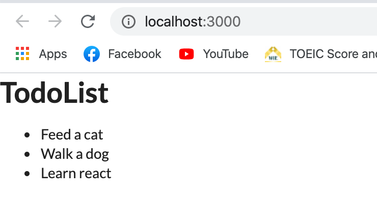
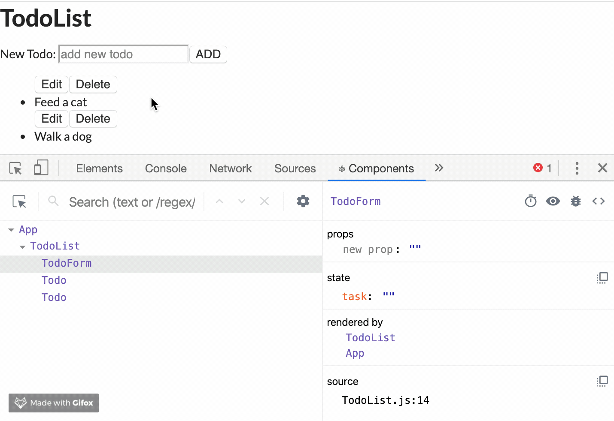

สวัสดีครับ วันนี้จะมาแนะนำการสร้าง Todo List app แบบง่าย ๆ นะครับ แน่นอนว่ามันอาจจะดูน่าเบื่อสำหรับบางคน แต่ผมว่ามันก็เป็นแบบฝึกที่ดีอันนึงในการเรียนรู้พื้นฐานของการสร้าง app แบบง่ายซึ่งมีการดำเนินการครบทั้ง Create Read Update และ Delete ถ้าเข้าใจแล้ว ก็สามารถต่อยอดไปยัง app ที่ซับซ้อนกว่านี้ได้ ผมเขียน blog นี้ไว้เพื่อทบกวนการเรียน React ของผมเอง ซึ่ง blog นี้ผมจะทำเป็น class component ก่อนนะครับ จากนั้นก็คิดว่าจะทำอีก blog นึงโดยใช้ React Hooks เริ่มกันเลยดีกว่าครับ :)

## Prerequisite

- HTML/CSS/Javascript เน้นๆ หน่อยว่าใช้ ES6 syntax
- Basic การสร้าง React component, props, state เบื้องต้น
- Node.js การ install dependencies ต่าง ๆ
- Basic Git

## App overview

เรามาวางโครงสร้างของตัว app กันก่อนดีกว่าว่า เราจะให้ components แต่ละอันมีลักษณะอย่างไร ซึ่งจริง ๆ แล้วก็ทำได้หลายแบบนะครับ ส่วนตัวผมขอสร้างตามรูปข้างล่าง


ถ้าเราทำการแบ่ง component ย่อยๆ ก็จะได้ว่า

- App component ตัวใหญ่สุด เป็นที่เก็บ components ย่อยต่างๆ
- TodoForm สำหรับรับค่า text ที่เรานำมาบันทึกลงไปในตัว component TodoList
- TodoList สำหรับเก็บตัว component todo แต่ละรายการ
- Todo ก็คือ component เล็กสุดที่แสดงรายการ todo ซึ่งสามารถ edit และ delete ได้

## Create Project

เริ่มจากใช้ boiler plate ของการสร้าง react app ก่อนเลยครับใช้คำสั่ง `create-react-app`

```shell
npx create-react-app todo-app
```

จากนั้นก็เข้าไปที่ `todo-app` directoty

```shell
cd todo-app
```

จากนั้นก็ลอง `yarn start` เพื่อ start development mode เมื่อเข้าไปที่ `localhost:3000` ก็จะเห็นหน้าตา react app แบบนี้


เปิด working directory ของเราด้วย vscode ก็จะเห็นว่าข้างในประกอบด้วย files และ folders มากมายนะครับ ผมขอไม่ลงรายละเอียดนะครับ คิดว่าทุกคนคงพอเข้าใจมาบ้างแล้ว


ทีนี้ผมจะลบทุกอย่างใน directory `src` ออกหมดเลยครับ เราจะสร้างเองตั้งแต่เริ่มต้น ใครจะเก็บไว้ก็ได้นะครับไม่มีปัญหา แล้วก็ผมขอเพิ่ม css library เข้าอีกตัวนึงเพิ่มจัดการความสวยงาม (ซึงผมเองก็ไม่ถนัดเท่าไหร่เล้ยยยย 5555555) โดยผมจะใช้ [semantic-ui](https://semantic-ui.com/) ครับ เราก็เอา cdn ไปแปะไว้ที่ `./public/index.html` ได้เลย จากนั้นภายใน folder `src` สร้างไฟล์ขึ้นมา 2 ไฟล์ครับคือ `index.js` และ `App.js`

ภายในไฟล์ `index.js`

```JSX
// index.js
import React from 'react'
import ReactDOM from 'react-dom'
import App from './App'

ReactDOM.render(<App />, document.getElementById('root'))
```

ภายในไฟล์ `App.js`

```JSX
import React from 'react';

const App = () => {
  return (
    <div>
      <h1>Hi, React</h1>
    </div>
  );
};

export default App;
```

ที่ Browser เราก็จะได้ app หน้าตาแบบนี้


ต่อไปก็ทำการสร้าง folder `components` เพื่อเก็บ components ต่างๆ ไว้ โดยสร้างตามที่เกริ่นไว้ตอนต้นเลยครับ ผมจะเริ่มจาก `TodoList.js` และผมก็จะกำหนด `state` ของ `todos` เป็น array ไว้เลยแบบนี้

```JSX
import React, { Component } from 'react';

export default class TodoList extends Component {
  state = { todos: [] };
  render() {
    return (
      <div>
        <h1>TodoList</h1>
        <ul>
          <li>Feed a cat</li>
          <li>Walk a dog</li>
          <li>Learn react</li>
        </ul>
      </div>
    );
  }
}
```

สาเหตุผลที่ทำเป็น array เนื่องจากเราต้องการที่จะ render ตัว todo ออกมาเป็น list รายการต่าง ๆ ดังนั้นเราจึงต้องเก็บไว้ในรูปของ array เพื่อให้ง่ายต่อการสร้าง components ด้วยการวนลูปนั่นเอง จากนั้นเราก็ทำการ `import` เข้าไปที่ไฟล์ `App.js` เลยครับ

```JSX
import React from 'react';
import TodoList from './components/TodoList';

const App = () => {
  return (
    <div>
      <TodoList />
    </div>
  );
};

export default App;
```

หน้าตา app ก็จะเปลี่ยนเป็น



ต่อไปก็ทำการสร้าง component `Todo.js` ขึ้นมา เพื่อแสดงรายการ todo แต่ละอัน โดยมีปุ่มเพื่อ edit และ delete แบบนี้

```JSX
import React, { Component } from 'react';

export default class Todo extends Component {
  render() {
    return (
      <div>
        <button>Edit</button>
        <button>Delete</button>
        <li>{this.props.task}</li>
      </div>
    );
  }
}
```

สังเกตเห็นว่าผมผ่านค่า `this.props.task` ลงไปใน `li` element ซึงยังไม่มีการกำหนดค่า `props` เหล่านั้นใน parent component (ก็คือ `TodoList`) ดังนั้นผมต้องกลับไปตั้งค่า props ใน `TodoList.js` ก่อน แบบนี้

```JSX
import React, { Component } from 'react';
import Todo from './Todo';

export default class TodoList extends Component {
  state = { todos: [{ task: 'Feed a cat' }, { task: 'Walk a dog' }] };
  render() {
    const todos = this.state.todos.map(todo => {
      return <Todo task={todo.task} />;
    });
    return (
      <div>
        <h1>TodoList</h1>
        <ul>{todos}</ul>
      </div>
    );
  }
}
```

ผมทำการเพิ่มรายการลงไปใน state `todos` เพื่อเก็บตัวแปร `task` (ในอนาคตก็มี `id`, `isComplete` อีก แต่ตอนนี้เอาแค่นี้ก่อน) ซึ่งเป็นตัวที่แสดงเนื้อหาของ todo จากนั้นผมก็เอามา map เข้าไปใน `Todo` component แล้วผ่านค่า `task` ให้เป็นหนึ่งใน `props` ของ `Todo` ครับ จากนี้เราก็สามารถแสดงรายการ `task` นี้ได้ที่ child component แล้วววแบบนี้


ดูไม่ได้เล้ยยยย ไว้เดี๋ยวค่อยแต่งอีกทีนะ 555555555

ต่อไปเราก็มาสร้าง `TodoForm.js` กัน โดยที่ form จะรับ input จาก user แล้วก็จะนำไปสร้างเก็บไว้ใน `state` จากนั้นก็จะส่งผ่าน props อีกทีเพื่อนำไป render ที่ `Todo` ครับ ซึ่ง form ของเรา เราต้องทำให้มันเป็น "Controlled Component" นั่นก็คือให้มันสามารถจัดการกับ state ของเราได้นั่นเอง

```JSX
import React, { Component } from 'react';

export default class TodoForm extends Component {
  state = { task: '' };

  handleChange = e => {
    this.setState({
      [e.target.name]: e.target.value
    });
  };

  render() {
    return (
      <form>
        <label htmlFor="task">New Todo: </label>
        <input
          type="text"
          placeholder="add new todo"
          id="task"
          name="task"
          value={this.state.task}
          onChange={this.handleChange}
        />
        <button>ADD</button>
      </form>
    );
  }
}
```

ทีนี้ลองมาดูกันว่า มีอะไรข้างใน `form` นี้บ้าง

- `state = { task: '' }` จากที่อธิบายไว้ข้างบนนะครับ ว่าเราต้องการให้ `form` สามารถควบคุม input จาก user ได้ ดังนั้นเราจึงต้องประกาศ `state` โดยให้ `task` มีค่าเท่ากับ empty string ก่อน และเราต้องผ่านค่า `state` ลงไปใน `value` ของ `input` ด้วย
- `handleChange` method ทำหน้าที่ `setState` ให้กับ `task` โดยกำหนดให้มีค่าเท่ากับ `e.target.value` ซึ่งก็คือค่า input ที่รับเข้ามานั่นเอง และผ่านค่าเข้าที่ event `onChange`

ทีนี้ลองมาดูที่ React DevTools กันบ้างนะครับว่าที่เราเขียนไปนั้นโอเครึป่าว



ตอนนี้ `state` ของเราก็เปลี่ยนแปลงตาม input ที่ user พิมพ์เข้าไปแล้ววว

## Create addNewTodo method
