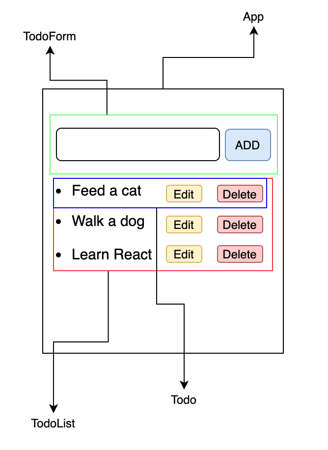
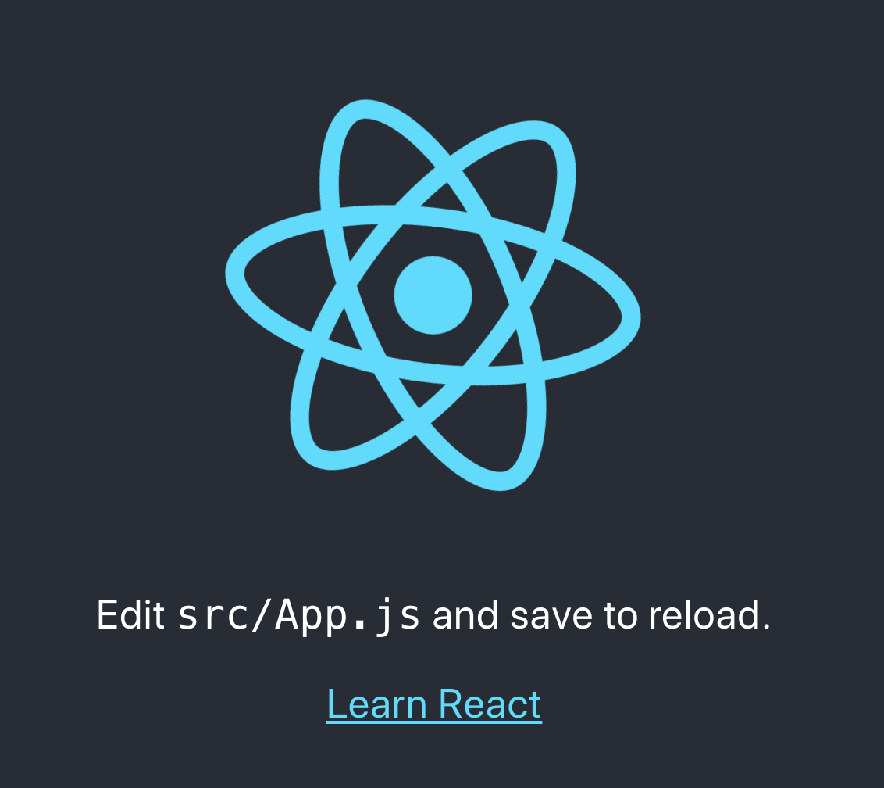
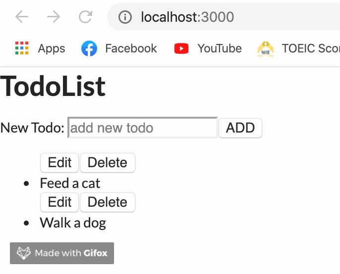

สวัสดีครับ วันนี้จะมาแนะนำการสร้าง Todo List app แบบง่าย ๆ นะครับ แน่นอนว่ามันอาจจะดูน่าเบื่อสำหรับบางคน แต่ผมว่ามันก็เป็นแบบฝึกที่ดีอันนึงในการเรียนรู้พื้นฐานของการสร้าง app แบบง่ายซึ่งมีการดำเนินการครบทั้ง Create Read Update และ Delete ถ้าเข้าใจแล้ว ก็สามารถต่อยอดไปยัง app ที่ซับซ้อนกว่านี้ได้ ผมเขียน blog นี้ไว้เพื่อทบกวนการเรียน React ของผมเอง ซึ่ง blog นี้ผมจะทำเป็น class component ก่อนนะครับ จากนั้นก็คิดว่าจะทำอีก blog นึงโดยใช้ React Hooks เริ่มกันเลยดีกว่าครับ :)

## Prerequisite

- HTML/CSS/Javascript เน้นๆ หน่อยว่าใช้ ES6 syntax
- Basic การสร้าง React component, `props`, `state` เบื้องต้น
- Node.js การ install dependencies ต่าง ๆ
- Basic Git

## App overview

เรามาวางโครงสร้างของตัว app กันก่อนดีกว่าว่า เราจะให้ components แต่ละอันมีลักษณะอย่างไร ซึ่งจริง ๆ แล้วก็ทำได้หลายแบบนะครับ ส่วนตัวผมขอสร้างตามรูปข้างล่าง



ถ้าเราทำการแบ่ง component ย่อยๆ ก็จะได้ว่า

- App component ตัวใหญ่สุด เป็นที่เก็บ components ย่อยต่างๆ
- TodoForm สำหรับรับค่า text ที่เรานำมาบันทึกลงไปในตัว component TodoList
- TodoList สำหรับเก็บตัว component todo แต่ละรายการ
- Todo ก็คือ component เล็กสุดที่แสดงรายการ todo ซึ่งสามารถ edit และ delete ได้

## Create Project

เริ่มจากใช้ boiler plate ของการสร้าง react app ก่อนเลยครับใช้คำสั่ง `create-react-app`

```shell
npx create-react-app todo-app
```

จากนั้นก็เข้าไปที่ `todo-app` directoty

```shell
cd todo-app
```

จากนั้นก็ลอง `yarn start` เพื่อ start development mode เมื่อเข้าไปที่ `localhost:3000` ก็จะเห็นหน้าตา react app แบบนี้



เปิด working directory ของเราด้วย vscode ก็จะเห็นว่าข้างในประกอบด้วย files และ folders มากมายนะครับ ผมขอไม่ลงรายละเอียดนะครับ คิดว่าทุกคนคงพอเข้าใจมาบ้างแล้ว


ทีนี้ผมจะลบทุกอย่างใน directory `src` ออกหมดเลยครับ เราจะสร้างเองตั้งแต่เริ่มต้น ใครจะเก็บไว้ก็ได้นะครับไม่มีปัญหา แล้วก็ผมขอเพิ่ม css library เข้าอีกตัวนึงเพิ่มจัดการความสวยงาม (ซึงผมเองก็ไม่ถนัดเท่าไหร่เล้ยยยย 5555555) โดยผมจะใช้ [semantic-ui](https://semantic-ui.com/) ครับ เราก็เอา cdn ไปแปะไว้ที่ `./public/index.html` ได้เลย จากนั้นภายใน folder `src` สร้างไฟล์ขึ้นมา 2 ไฟล์ครับคือ `index.js` และ `App.js`

ภายในไฟล์ `index.js`

```JSX
// index.js
import React from 'react'
import ReactDOM from 'react-dom'
import App from './App'

ReactDOM.render(<App />, document.getElementById('root'))
```

ภายในไฟล์ `App.js`

```JSX
import React from 'react';

const App = () => {
  return (
    <div>
      <h1>Hi, React</h1>
    </div>
  );
};

export default App;
```

ที่ Browser เราก็จะได้ app หน้าตาแบบนี้


ต่อไปก็ทำการสร้าง folder `components` เพื่อเก็บ components ต่างๆ ไว้ โดยสร้างตามที่เกริ่นไว้ตอนต้นเลยครับ ผมจะเริ่มจาก `TodoList.js` และผมก็จะกำหนด `state` ของ `todos` เป็น array ไว้เลยแบบนี้

```JSX
import React, { Component } from 'react';

export default class TodoList extends Component {
  state = { todos: [] };
  render() {
    return (
      <div>
        <h1>TodoList</h1>
        <ul>
          <li>Feed a cat</li>
          <li>Walk a dog</li>
          <li>Learn react</li>
        </ul>
      </div>
    );
  }
}
```

สาเหตุผลที่ทำเป็น array เนื่องจากเราต้องการที่จะ render ตัว todo ออกมาเป็น list รายการต่าง ๆ ดังนั้นเราจึงต้องเก็บไว้ในรูปของ array เพื่อให้ง่ายต่อการสร้าง components ด้วยการวนลูปนั่นเอง จากนั้นเราก็ทำการ `import` เข้าไปที่ไฟล์ `App.js` เลยครับ

```JSX
import React from 'react';
import TodoList from './components/TodoList';

const App = () => {
  return (
    <div>
      <TodoList />
    </div>
  );
};

export default App;
```

หน้าตา app ก็จะเปลี่ยนเป็น


ต่อไปก็ทำการสร้าง component `Todo.js` ขึ้นมา เพื่อแสดงรายการ todo แต่ละอัน โดยมีปุ่มเพื่อ edit และ delete แบบนี้

```JSX
import React, { Component } from 'react';

export default class Todo extends Component {
  render() {
    return (
      <div>
        <button>Edit</button>
        <button>Delete</button>
        <li>{this.props.task}</li>
      </div>
    );
  }
}
```

สังเกตเห็นว่าผมผ่านค่า `this.props.task` ลงไปใน `li` element ซึงยังไม่มีการกำหนดค่า `props` เหล่านั้นใน parent component (ก็คือ `TodoList`) ดังนั้นผมต้องกลับไปตั้งค่า `props` ใน `TodoList.js` ก่อน แบบนี้

```JSX
import React, { Component } from 'react';
import Todo from './Todo';

export default class TodoList extends Component {
  state = { todos: [{ task: 'Feed a cat' }, { task: 'Walk a dog' }] };
  render() {
    const todos = this.state.todos.map(todo => {
      return <Todo task={todo.task} />;
    });
    return (
      <div>
        <h1>TodoList</h1>
        <ul>{todos}</ul>
      </div>
    );
  }
}
```

ผมทำการเพิ่มรายการลงไปใน state `todos` เพื่อเก็บตัวแปร `task` (ในอนาคตก็มี `id`, `isComplete` อีก แต่ตอนนี้เอาแค่นี้ก่อน) ซึ่งเป็นตัวที่แสดงเนื้อหาของ todo จากนั้นผมก็เอามา map เข้าไปใน `Todo` component แล้วผ่านค่า `task` ให้เป็นหนึ่งใน `props` ของ `Todo` ครับ จากนี้เราก็สามารถแสดงรายการ `task` นี้ได้ที่ child component แล้วววแบบนี้


ดูไม่ได้เล้ยยยย ไว้เดี๋ยวค่อยแต่งอีกทีนะ 555555555

ต่อไปเราก็มาสร้าง `TodoForm.js` กัน โดยที่ form จะรับ input จาก user แล้วก็จะนำไปสร้างเก็บไว้ใน `state` จากนั้นก็จะส่งผ่าน `props` อีกทีเพื่อนำไป render ที่ `Todo` ครับ ซึ่ง form ของเรา เราต้องทำให้มันเป็น "Controlled Component" นั่นก็คือให้มันสามารถจัดการกับ state ของเราได้นั่นเอง

```JSX
import React, { Component } from 'react';

export default class TodoForm extends Component {
  state = { task: '' };

  handleChange = e => {
    this.setState({
      [e.target.name]: e.target.value
    });
  };

  render() {
    return (
      <form>
        <label htmlFor="task">New Todo: </label>
        <input
          type="text"
          placeholder="add new todo"
          id="task"
          name="task"
          value={this.state.task}
          onChange={this.handleChange}
        />
        <button>ADD</button>
      </form>
    );
  }
}
```

ทีนี้ลองมาดูกันว่า มีอะไรข้างใน `form` นี้บ้าง

- `state = { task: '' }` จากที่อธิบายไว้ข้างบนนะครับ ว่าเราต้องการให้ `form` สามารถควบคุม input จาก user ได้ ดังนั้นเราจึงต้องประกาศ `state` โดยให้ `task` มีค่าเท่ากับ empty string ก่อน และเราต้องผ่านค่า `state` ลงไปใน `value` ของ `input` ด้วย
- `handleChange` method ทำหน้าที่ `setState` ให้กับ `task` โดยกำหนดให้มีค่าเท่ากับ `e.target.value` ซึ่งก็คือค่า input ที่รับเข้ามานั่นเอง และผ่านค่าเข้าที่ event `onChange`

ทีนี้ลองมาดูที่ React DevTools กันบ้างนะครับว่าที่เราเขียนไปนั้นโอเครึป่าว


ตอนนี้ `state` ของเราก็เปลี่ยนแปลงตาม input ที่ user พิมพ์เข้าไปแล้ววว

## Create addNewTodo method

ทีนี้ก็มาสร้างวิธีที่จะเพิ่ม todo จาก form นะครับ ถ้าย้อนกลับขึ้นไปดูโครงสร้างของ app ข้างบน เราจะเห็นว่า `TodoList.js` เป็น Parent Component ของ `Todo.js` อีกที ดังนั้น เราต้องสร้าง method `addNewTodo` ไว้ที่ `TodoList.js` แล้วทำการส่ง method นี้ผ่านทาง `props` ไปยัง `TodoForm.js` อีกที

```JSX
// TodoList.js
import React, { Component } from 'react';
import Todo from './Todo';
import TodoForm from './TodoForm';

export default class TodoList extends Component {
  state = { todos: [{ task: 'Feed a cat' }, { task: 'Walk a dog' }] };

  // add new todo
  addNewTodo = newTask => {
    this.setState({ todos: [...this.state.todos, newTask] });
  };

  render() {
    const todos = this.state.todos.map(todo => {
      return <Todo task={todo.task} />;
    });
    return (
      <div>
        <h1>TodoList</h1>
        <TodoForm addNewTodo={this.addNewTodo} />
        <ul>{todos}</ul>
      </div>
    );
  }
}
```

จากนั้นกลับไปที่ `TodoForm.js` เราต้องเพิ่ม `handleSubmit` เพื่อรับเอา `addNewTodo` มาใช้งานอีกทีแบบนี้

```JSX
import React, { Component } from 'react';
import { v4 as uuid } from 'uuid';

export default class TodoForm extends Component {
  state = { task: '' };

  handleChange = e => {
    this.setState({
      [e.target.name]: e.target.value
    });
  };

  handleSubmit = e => {
    e.preventDefault();
    this.props.addNewTodo({ ...this.state, id: uuid() , isComplete: false});
    this.setState({ task: '' });
  };

  render() {
    return (
      <form onSubmit={this.handleSubmit}>
        <label htmlFor="task">New Todo: </label>
        <input
          type="text"
          placeholder="add new todo"
          id="task"
          name="task"
          value={this.state.task}
          onChange={this.handleChange}
        />
        <button>ADD</button>
      </form>
    );
  }
}

```

จาก function `handleSubmit` เราสามารถเรียก method `addNewTodo` ผ่านทาง `props` ได้เลย โดย method `addNewTodo` รับพารามิเตอร์หนึ่งตัวซึ่งก็คือ `newTask` นั่นหมายความว่าเราสามารถผ่านค่า `this.state` แล้วก้ถือโอกาสนี้เพิ่ม `id` เพื่อที่นำไปใช้ตรวจสอบกับ method อื่นๆ รวมถึงนำไปสร้างเป็น `key` properties ด้วย และ `isComplete` เพื่อที่จะนำไปเช็คว่า task ไหนที่เสร็จแล้วบ้าง แล้วทีนี้ผมต้องการให้ input ,มัน reset เป็นค่าว่างๆ ด้วย ผมจึงต้อง `setState` กลับไปให้เป็น empty string อีกรอบ คราวนี้ลองเพิ่ม todo ที่ browser กันดูครับ


เรียบร้อยยย เพิ่มได้ละ

## Deleting Todo

ในการที่จะลบ todo แต่ละอันออกนั้น เราต้องสร้าง id ให้กับมันก่อน (โดยการใช้ uuid) ทีนี้ก็ทำคล้ายๆ กับ method `addNewTodo` ครับ โดยสร้างไว้ที่ `TodoList` component จากนั้นส่งผ่าน `props` ไปยัง component ที่จะใช้งาน ซึ่งก็คือ `Todo.js` นั่นเอง อ้อออ อย่าลืมส่งผ่าน `id` ผ่าน `props` ไปด้วยนะครับ

```JSX
import React, { Component } from 'react';
import Todo from './Todo';
import TodoForm from './TodoForm';

export default class TodoList extends Component {
  state = {
    todos: [
      { task: 'Feed a cat', id: 1, isComplete: false },
      { task: 'Walk a dog', id: 2, isComplete: false }
    ]
  };

  // add new todo
  addNewTodo = newTask => {
    this.setState({ todos: [...this.state.todos, newTask] });
  };

  // delte todo
  deleteTodo = id => {
    this.setState({
      todos: [...this.state.todos.filter(todo => todo.id !== id)]
    });
  };

  render() {
    const todos = this.state.todos.map(todo => {
      return (
        <Todo
          task={todo.task}
          key={todo.id}
          id={todo.id}
          deleteTodo={this.deleteTodo}
        />
      );
    });
    return (
      <div>
        <h1>TodoList</h1>
        <TodoForm addNewTodo={this.addNewTodo} />
        <ul>{todos}</ul>
      </div>
    );
  }
}
```

มาดูกันที่ `deleteTodo` method นะครับ เราจะผ่านค่า `id` ลงไปเพื่อนำไปตรวจสอบกับแต่ละ `todo` ว่าตรงกันหรือไม่ ถ้าตรงกัน เราก็จะ filter `todo` ตัวนั้นออกไป และนำค่าที่เหลือมา `setState` อีกครั้ง จากนั้น ไปที่ `Todo.js` เพื่อนำ method `deleteTodo` ไปใช้กับ delete button แบบนี้

```JSX
import React, { Component } from 'react';

export default class Todo extends Component {
  handleDelete = () => {
    this.props.deleteTodo(this.props.id);
  };

  render() {
    return (
      <div>
        <button>Edit</button>
        <button onClick={this.handleDelete}>Delete</button>
        <li>{this.props.task}</li>
      </div>
    );
  }
}
```

เช็คกันที่ browser อีกที


Coooool!

## Edit todo

คราวนี้ก็มาถึงส่วนของการ edit แต่ละ todo กันบ้าง function นี้อาจจะดูซับซ้อนนิดหน่อย ผมจะเรียงเป็นข้อๆ แบบนี้

- เพิ่ม `state` เข้ามาอีก 2 ตัว `isEditing` และ `task` โดยให้ค่าเริ่มต้นของ `isEditing` เป็น `false` โดยมีหลักการดังนี้
  - ถ้า `isEditing` เป็น `true` ก็ให้มี `form` เด้งออกมา
  - ถ้า `isEditing` เป็น `false` ก็ให้ render ตามปกติ
- ค่าเริ่มต้นของ `task` ให้มีค่าเท่ากับ `this.props.task` ตามที่ได้รับมาจาก Parent component เพื่อที่เราสามารถนำไปแสดงใน `editForm` ได้
- สร้าง method สำหรับ toggle `editForm` เพื่อทำงานร่วมกับ `onClick` event ที่ edit button
- สร้าง method เพื่อ submit form หลังจากที่ edit เสร็จเรียบร้อย เพื่อทำงานร่วมกับ `onSubmit` event ที่ `editForm` โดยที่ method นี้ต้องกลับไปสร้างที่ Parent component แล้วเรียกผ่าน `props` มาเหมือนเดิม

หน้าตาของ code ที่ได้ก็จะเป็นแบบนี้

```JSX
// Todo.js
import React, { Component } from 'react';

export default class Todo extends Component {
  state = { isEditing: false, task: this.props.task };

  handleDelete = () => {
    this.props.deleteTodo(this.props.id);
  };

  toggleEditForm = () => {
    this.setState({ isEditing: !this.state.isEditing });
  };

  handleUpdate = e => {
    e.preventDefault();
    // we need to create this call this method via props
  };

  handleChange = e => {
    this.setState({
      [e.target.name]: e.target.value
    });
  };

  render() {
    let content;
    if (this.state.isEditing) {
      content = (
        <div>
          <form action="" onSubmit={this.handleUpdate}>
            <input
              type="text"
              name="task"
              value={this.state.task}
              onChange={this.handleChange}
            />
            <button>Save</button>
          </form>
        </div>
      );
    } else {
      content = (
        <div>
          <button onClick={this.toggleEditForm}>Edit</button>
          <button onClick={this.handleDelete}>Delete</button>
          <li>{this.props.task}</li>
        </div>
      );
    }
    return content;
  }
}

```

ตามที่เกริ่นไว้ตอนต้นว่า method `handleUpdate` ต้องสร้างไว้ที่ Parent component แล้วเรียกผ่าน `props` ดังนั้นก็ไปสร้างกันเลยครับ (code อื่นๆ เหมือนเดิม แค่เพิ่ม `updateTodo` ต่อจาก `deleteTodo` แล้วก็อย่างลืมส่งผ่าน `props` ใน component `<Todo/>` ด้วยนะครับ)

```JSX
// update todo
  updateTodo = (id, updateTask) => {
    const updatedTodos = this.state.todos.map(todo => {
      if (todo.id === id) {
        return { ...todo, task: updateTask };
      }
      return todo;
    });
    this.setState({
      todos: updatedTodos
    });
  };
```

function `updateTodo` ก็จะรับ parameter 2 ตัวนั่นก็คือ id และ updateTask จากนั้นเราก็เช็คดูว่า id ของ todo นั้น ๆ ตรงกันกับตัวที่เราจะ edit ใหม่รึป่าว ถ้าตรงกันก็แทนค่าใหม่ด้วย `updateTask` และ return array ของ `todos` ใหม่ออกมา คราวนี้ภายใน `handleUpdate` method ก็สามารถเรียกใช้ `updateTodo` ได้เป็นแบบนี้

```JSX
handleUpdate = e => {
    e.preventDefault();
    this.props.updateTodo(this.props.id, this.state.task);
    this.setState({isEditing: false})
  };
```

Let's test in the browser!



โอเคคคคค

โดยรวมแล้วก็ประมาณนี้นะครับ ตอนแรกว่าจะเพิ่ม toggleComplete ด้วยแต่คิดว่าจะยาวเกินไป จริงๆ แล้วมีอยู่ใน [repository](https://github.com/xeusteerapat/todo-app-playground) นี้หมดเลย รวม styling แล้วด้วยยย หวังว่าจะมีประโยชน์ต่อผู้อ่านทุกท่านนะครับ

Happy Coding :)

_[Reference: The Modern React Bootcamp (Hooks, Context, NextJS, Router)](https://www.udemy.com/course/modern-react-bootcamp/)_
