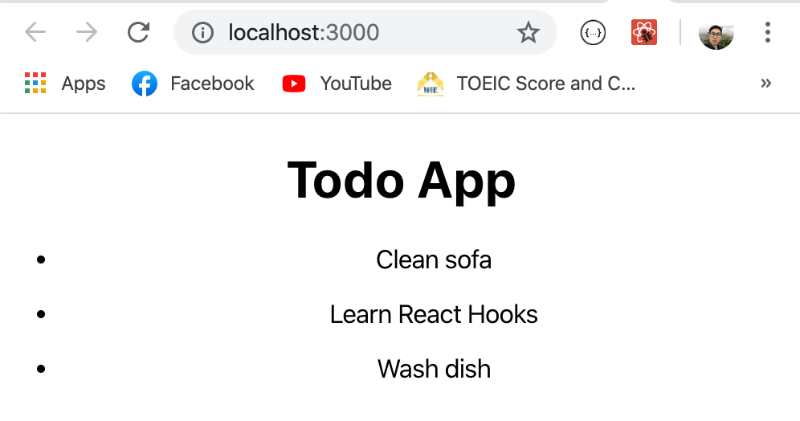
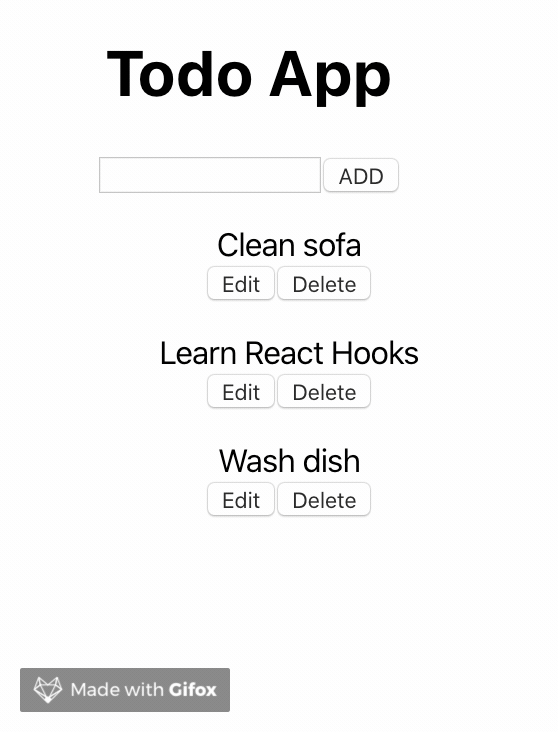

จาก [blog ที่แล้วเราได้ลองเขียน](https://xeusteerapat.github.io/blog/basic-react-todo-app) Todo list app แบบใช้ class component กันไปแล้ว คราวนี้ผมจะมาเขียน Todo list เหมือนเดิมแต่ว่าเปลี่ยนมาใช้เป็น React Hooks แทนนะครับ ซึ่งเจ้าตัว Hooks เนี่ยหลัก ๆ แล้ว React Team พัฒนาขึ้นมาโดยมีวัตถุประสงค์หลัก ๆ คือ

- สามารถใช้งาน state ได้ใน Functional component โดยที่ไม่ต้องประกาศ class
- Code reusable ระหว่าง component เพื่อให้เราสามารถแชร์ logic ระหว่าง component อื่นๆ ได้

พื้นฐานการใช้ React Hooks ที่ทุกคนใช้กันบ่อยๆ ก็คือ `useState` และ `useEffect` ซึ่งวันนี้ผมขอใช้งานเฉพาะ `useState` ก่อนนะครับ แล้ว blog ต่อๆไป จะมาอธิบายการใช้งาน `useEffect` อีกที

## A taste of React hooks

ลองมาดูหน้าตาคร่าว ๆ ของเจ้า React hooks กันก่อนโดยเปรียบเทียบกับ class component แบบเดิม โดยผมจะทำเป็น counter app ง่าย ๆ ก่อนนะครับ

```jsx
import React from "react";

export default class App extends React.Component {
  constructor(props) {
    super(props);
    this.state = { count: 0 };
    this.incrementCount = this.incrementCount.bind(this);
    this.decrementCount = this.decrementCount.bind(this);
  }

  incrementCount() {
    this.setState({ count: this.state.count + 1 });
  }
  decrementCount() {
    this.setState({ count: this.state.count - 1 });
  }

  render() {
    return (
      <div>
        <h1>Count: {this.state.count}</h1>
        <button onClick={this.incrementCount}>Increment</button>
        <button onClick={this.decrementCount}>Decrement</button>
      </div>
    );
  }
}
```

แล้วทีนี้ลองเปลี่ยนมาเขียนโดยใช้ Hooks กันบ้าง

```jsx
import React, { useState } from "react";

const App = () => {
  const [count, setCounter] = useState(0);

  const incrementCount = () => {
    setCounter(count + 1);
  };

  const decrementCount = () => {
    setCounter(count - 1);
  };

  return (
    <div>
      <h1>Count: {count}</h1>
      <button onClick={incrementCount}>Increment</button>
      <button onClick={decrementCount}>Decrement</button>
    </div>
  );
};

export default App;
```

โดยหลักการก็คือ เราจะเรียกใช้งาน `useState` และใส่ค่าเริ่มต้นให้มีค่าเท่ากับ 0 จากนั้น `useState` จะคืนค่าออกมาเป็น Array และเราสามารถ destructuring ให้อยู่ในต 2 ตัวแปรคือ

- `state` ในปัจจุบันของ component นั้นๆ (`count`)
- function สำหรับการอัพเดท `state` นั้นๆ (`setCounter`)

เห็นมั้ยครับว่า code ดู clean ขึ้นเลยทีเดียวไม่ต้องประกาศ class, constructor หรือ bind method ให้วุ่นวาย ทีนี้เรามาลองทำ Todo list ด้วย hooks กันดูบ้าง

## Setup project

เหมือนเดิมครับ ก็เรียกคำสั่ง `create-react-app`

```bash
npx create-react-app todo-app-with-hooks
```

จากนั้นเราก็สร้าง folder components ขึ้นมาใน `src` directory อีกที พร้อมกับสร้างไฟล์รอไว้เลยครับ ดังน้ี

- TodoApp.js
- TodoList.js
- TodoForm.js
- Todo.js
- EditTodoForm.js

โครงสร้างของ App ก็จะเป็นเหมือนกับ blog ก่อนหน้าเลยนะครับ คือเราจะเก็บ methods ต่างๆ ไว้ใน `TodoApp.js` แล้วให้ component อื่นเรียกผ่าน props ผมจะสร้าง mock up เพื่อให้ render todo คร่าวๆ สัก 2-3 อันเพื่อให้เห็นภาพก่อนนะครับ และเราก็จะใช้งานมันผ่าน `useState` ครับผม

```jsx
// TodoApp.js
import React, { useState } from 'react';
import TodoList from './TodoList';

const TodoApp = () => {
  const initialTodos = [
    { id: 1, task: 'Clean sofa', completed: false },
    { id: 2, task: 'Learn React Hooks', completed: true },
    { id: 3, task: 'Wash dish', completed: false },
  ];

  const [todos, setTodos] = useState(initialTodos);

  return (
    <div>
      <h1>Todo App</h1>
      <TodoList todos={todos} />
    </div>
  );
};

export default TodoApp;

```

ทีนี้เราก็สร้าง component `TodoList` ขึ้นมา ข้างในก็มีการใช้ function `map` ค่าของ `task` เข้ากับแต่ `Todo` ครับ พร้อมกับส่งค่า `task` ผ่าน `props` เพื่อนำไปใช้ใน `Todo.js` ต่อไป แบบนี้

```jsx
// TodoList.js
import React from 'react';
import Todo from './Todo';

const TodoList = ({ todos }) => {
  return (
    <div>
      {todos.map((todo) => (
        <Todo task={todo.task} />
      ))}
    </div>
  );
};

export default TodoList;
```

ต่อไปใน `Todo.js` ก็สร้าง list ของแต่ละ task ขึ้นมาแบบนี้

```jsx
// Todo.js
import React from 'react';

const Todo = ({ task }) => {
  return (
    <div>
      <ul>
        <li>{task}</li>
      </ul>
    </div>
  );
};

export default Todo;
```

ถ้าเข้าไปที่ `localhost:3000` ก็จะเห็นหน้าตาแบบนี้



## Adding New Todo

App ของเราก็มีฟังก์ชั่นการใช้งานเหมือนเดิมเลยคือ create update delete ได้เหมือนครั้งก่อน เริ่มต้นที่ addNewTodo กันก่อนเลยครับ แต่ก่อนอื่นต้องสร้าง form component ใน `TodoForm.js` ซะก่อนน แบบนี้

```jsx
import React from 'react';

const TodoForm = () => {
  return (
    <div>
      <form action="">
        <input type="text" />
        <button>ADD</button>
      </form>
    </div>
  );
};

export default TodoForm;
```

แล้วก็ import เข้าไปที่ `TodoApp.js` แบบนี้

```jsx
  <div>
    <h1>Todo App</h1>
    <TodoForm />
    <TodoList todos={todos} />
  </div>
```

ต่อไปก็สร้าง method สำหรับเพิ่ม todo ลงไปใน `TodoApp.js` แบบนี้ แล้วก็ส่งผ่าน props เหมือนเดิม (เกือบลืม ต้องใช้ `uuid` เพื่อสร้าง `id` ให้กับแต่ละ `todo` ด้วยนะครับ)

```jsx
import React, { useState } from 'react';
import TodoList from './TodoList';
import TodoForm from './TodoForm';
import { v4 as uuid } from 'uuid';

const TodoApp = () => {
  const initialTodos = [
    { id: 1, task: 'Clean sofa', completed: false },
    { id: 2, task: 'Learn React Hooks', completed: true },
    { id: 3, task: 'Wash dish', completed: false },
  ];

  const [todos, setTodos] = useState(initialTodos);

  const addNewTodo = (newTask) => {
    setTodos([...todos, { id: uuid(), task: newTask, completed: false }]);
  };

  return (
    <div>
      <h1>Todo App</h1>
      <TodoForm addNewTodo={addNewTodo} />
      <TodoList todos={todos} />
    </div>
  );
};

export default TodoApp;
```

อย่างที่เคยเกริ่นไว้ตั้งแต่ตอนต้นนะครับว่าเราสามารถใช้ concept ของ hooks แชร์ logic ระหว่าง component ได้ โดยทำการสร้าง `customHook` function ขึ้นมา จากนั้นก็ import มาใช้เหมือนกับ function ทั่วไป ผมจะสร้าง folder ชื่อว่า `hooks` ขึ้นมาใน `src` directory จากนั้นก็สร้างไฟล์ชื่อว่า `useInputState.js` โดยที่จะสร้างฟังก์ชั่นเพื่อควบคุมการทำงานของ input form ไว้ในนี้ครับ

```jsx
import { useState } from 'react';

const useInputState = (initialValue) => {
  const [value, setValue] = useState(initialValue);

  const handleChange = (e) => {
    setValue(e.target.value);
  };

  const reset = () => {
    setValue('');
  };

  return [value, handleChange, reset];
};

export default useInputState;
```

ลองมาดูว่าข้างใน `useInputState` มีอะไรกันบ้าง

- `useInputState` รับพารามิเตอร์ `initialValue` เป็นค่าเริ่มต้น
- ประกาศ `value` และ `setValue` เพื่อนำไปจัดการกับ `state`
- ประกาศ method `handleChange` เพื่อรับค่า input (`e.target.value`) จาก user จากนั้นก็เรียก `setValue` กับ input นั้นๆ
- ประกาศ method `reset` เพื่อ reset input จาก user ให้เป็น empty string หลังจาก submit
- ทำการ return `[value, handleChange, reset]` ให้อยู่ในรูปของ Array

ทีนี้ `TodoForm.js` เราจะใช้งาน method `addNewTodo` ร่วมกับตัว `useInputState` แบบนี้

```jsx
import React from 'react';
import useInputState from '../hooks/useInputState';

const TodoForm = ({ addNewTodo }) => {
  const [value, handleChange, reset] = useInputState('');

  return (
    <div>
      <form
        action=""
        onSubmit={(e) => {
          e.preventDefault();
          addNewTodo(value);
          reset();
        }}
      >
        <input type="text" value={value} onChange={handleChange} />
        <button>ADD</button>
      </form>
    </div>
  );
};

export default TodoForm;
```

ลองมา test กันที่ browser ดูครับว่าเรา add new todo ได้รึป่าว


เยี่ยมมมครับบ (ปล.​react จะฟ้อง `unique key props` ใน console เดี๋ยวเราค่อยเพิ่มทีหลังได้ครับ)

## Update todo

ผมจะทำคล้าย ๆ กับ blog ก่อนหน้านี้นะครับ โดยจะสร้าง `EditTodoForm.js` แล้วใช้การคลิก edit button เพื่อ toggle ให้มันโชว์ขึ้นมา แล้วผมก็จะสร้าง method `updateTodo` ใน `TodoApp.js` เพื่อส่งผ่าน `props` มาด้วยครับ

```jsx
// updateTodo in TodoApp.js
  const updateTodo = (todoId, newTask) => {
    const updatedTodos = todos.map((todo) =>
      todo.id === todoId ? { ...todo, task: newTask } : todo
    );
    setTodos(updatedTodos);
  };
```

คราวนี้เพื่อให้ button สามารถ toggle ได้ ผมจะใช้ hooks เข้ามาช่วยโดยการสร้าง `useToggle` ขึ้นมาครับ

```jsx
// useToggle.js
import { useState } from 'react';

const useToggle = (initialValue = false) => {
  const [state, setState] = useState(initialValue);

  const toggle = () => {
    setState(!state);
  };
  return [state, toggle];
};

export default useToggle;
```

ข้างใน `useToggle` จะรับค่าที่เป็น `false` ก่อนนะครับ จากนั้นเราจะ setState ตัวนั้นโดยใช้นิเสธ (!)

มากันที่ `EditTodoForm.js` ทีนี้ผมจะ reuse logic ของ `useInputState` เพื่อใช้กับ `EditTodoForm` เพราะว่าเป็นการทำงานกับ form แบบเดียวกันเลย เพียงแต่ input เปลี่ยนไปเท่านั้น เริ่มเห็นประโยชน์ของ hooks แล้วใช่มั้ยล่ะครับ

```jsx
// EditTodoForm.js
import React from 'react';
import useInputState from '../hooks/useInputState';

const EditTodoForm = ({ updateTodo, id, task }) => {
  const [editValue, handleChange, reset] = useInputState(task);
  return (
    <div>
      <form
        action=""
        onSubmit={(e) => {
          e.preventDefault();
          updateTodo(id, editValue);
          reset();
        }}
      >
        <input type="text" value={editValue} onChange={handleChange} />
        <button>Save</button>
      </form>
    </div>
  );
};

export default EditTodoForm;
```

กลับมาที่ `Todo.js` เราก็ทำการ import `EditTodoForm` component เข้ามาโดยที่ทำงานร่วมกับ logic ของ `useToggle` เพื่อ toggle edit form แบบนี้

```jsx
// Todo.js
import React from 'react';
import EditTodoForm from './EditTodoForm';
import useToggle from '../hooks/useToggle';

const Todo = ({ id, task, updateTodo }) => {
  const [isEditing, toggle] = useToggle();
  return (
    <div>
      <ul>
        {isEditing ? (
          <EditTodoForm
            updateTodo={updateTodo}
            id={id}
            task={task}
            toggleEditForm={toggle}
          />
        ) : (
          <li>{task}</li>
        )}
        <button onClick={() => toggle()}>Edit</button>
        <button>Delete</button>
      </ul>
    </div>
  );
};

export default Todo;
```

สังเกตว่าผมจะผ่านค่า `toggleEditForm={toggle}` ด้วยเนื่องจาก `EditTodoForm` ต้องเรียก method `toggle` นี้ด้วยหลังจากที่เรา update todo เสร็จเพื่อทำให้ edit form หายไปนั่นเอง

```jsx
// EditTodoForm.js
import React from 'react';
import useInputState from '../hooks/useInputState';

const EditTodoForm = ({ updateTodo, id, task, toggleEditForm }) => {
  const [editValue, handleChange, reset] = useInputState(task);
  return (
    <div>
      <form
        action=""
        onSubmit={(e) => {
          e.preventDefault();
          updateTodo(id, editValue);
          reset();
          toggleEditForm(); // this one
        }}
      >
        <input type="text" value={editValue} onChange={handleChange} />
        <button>Save</button>
      </form>
    </div>
  );
};

export default EditTodoForm;
```

ลองมา update todo กันที่ Browser ครับ


Coooooool!!!

## Delete todo

สุดท้ายแล้วนะครับ ผมก็จะทำการสร้าง method สำหรับลบ todo ออกจาก list ผ่านการกดปุ่ม delete ที่เราสร้างไว้ ก็เช่นเคยครับ กลับไปสร้างที่ `TodoApp.js` แล้วเรียกผ่าน `props` เพื่อใช้งานใน `Todo.js`

```jsx
// TodoApp.js
import React, { useState } from 'react';
import TodoList from './TodoList';
import TodoForm from './TodoForm';
import { v4 as uuid } from 'uuid';

const TodoApp = () => {
  const initialTodos = [
    { id: 1, task: 'Clean sofa', completed: false },
    { id: 2, task: 'Learn React Hooks', completed: true },
    { id: 3, task: 'Wash dish', completed: false },
  ];

  const [todos, setTodos] = useState(initialTodos);

  const addNewTodo = (newTask) => {
    setTodos([...todos, { id: uuid(), task: newTask, completed: false }]);
  };

  const updateTodo = (todoId, newTask) => {
    const updatedTodos = todos.map((todo) =>
      todo.id === todoId ? { ...todo, task: newTask } : todo
    );
    setTodos(updatedTodos);
  };

  const deleteTodo = (todoId) => {
    const updatedTodos = todos.filter((todo) => todo.id !== todoId);
    setTodos(updatedTodos);
  };

  return (
    <div>
      <h1>Todo App</h1>
      <TodoForm addNewTodo={addNewTodo} />
      <TodoList todos={todos} updateTodo={updateTodo} deleteTodo={deleteTodo} />
    </div>
  );
};

export default TodoApp;
```

TodoList.js

```jsx
// TodoList.js
import React from 'react';
import Todo from './Todo';

const TodoList = ({ todos, updateTodo, deleteTodo }) => {
  return (
    <div>
      {todos.map((todo) => (
        <Todo
          task={todo.task}
          updateTodo={updateTodo}
          id={todo.id}
          key={todo.id}
          deleteTodo={deleteTodo}
        />
      ))}
    </div>
  );
};

export default TodoList;
```

และที่ delete button ก็เพิ่ม `onClick` event เข้าไปและเรียกใช้ method `deleteTodo`

```jsx
// Todo.js
import React from 'react';
import EditTodoForm from './EditTodoForm';
import useToggle from '../hooks/useToggle';

const Todo = ({ id, task, updateTodo, deleteTodo }) => {
  const [isEditing, toggle] = useToggle();
  return (
    <div>
      <ul>
        {isEditing ? (
          <EditTodoForm
            updateTodo={updateTodo}
            id={id}
            task={task}
            toggleEditForm={toggle}
          />
        ) : (
          <li>{task}</li>
        )}
        <button onClick={() => toggle()}>Edit</button>
        <button onClick={() => deleteTodo(id)}>Delete</button>
      </ul>
    </div>
  );
};

export default Todo;
```

เช็คที่ browser อีกทีครับว่าลบได้จริงรึป่าวววว



ทั้งหมดก็ประมาณนี้ครับ [repository](https://github.com/xeusteerapat/todo-app-with-hooks) คือ repo ของ blog นี้นะครับ แต่ว่าผมจะเพิ่ม Styling ด้วย [Material-Ui](https://material-ui.com/) และมีฟังก์ชั่น complete ด้วยการใช้ checkbox แต่ตัวหลัก ๆ ที่เหมือนกันแทบทุกอย่างเลยครับ ไว้โอกาสหน้าจะมาแนะนำการทำ custom hook เพิ่มเติม และการใช้ `useEffect` อีกครับผมมมม

Happy Coding :)

## References

- _[The Modern React Bootcamp (Hooks, Context, NextJS, Router)](https://www.udemy.com/course/modern-react-bootcamp/)_
- _[เพิ่มความสามารถให้กับ Functional Component ด้วย React Hooks จาก React 16.7.0](https://medium.com/@rennerwin/ %E0%B9%80%E0%B8%9E%E0%B8%B4%E0%B9%88%E0%B8%A1%E0%B8%84%E0%B8%A7%E0%B8%B2%E0%B8%A1%E0%B8%AA%E0%B8%B2%E0%B8%A1%E0%B8%B2%E0%B8%A3%E0%B8%96%E0%B9%83%E0%B8%AB%E0%B9%89%E0%B8%81%E0%B8%B1%E0%B8%9A-functional-component-%E0%B8%94%E0%B9%89%E0%B8%A7%E0%B8%A2-react-hooks-%E0%B8%88%E0%B8%B2%E0%B8%81-react-16-7-0-b41e94d3464d)_
- _[ทำความรู้จักกับ Hooks ของ React: ฟีเจอร์ที่จะมาเปลี่ยนการเขียน React ไปตลอดกาล](https://microbenz.in.th/react-hooks-101)_
- _[สอนการใช้งาน React Hooks เข้าใจใน 5 นาที](https://www.youtube.com/watch?v=gCVhvWes660)_
