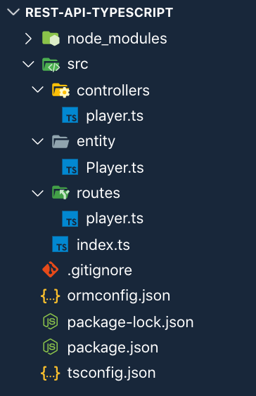
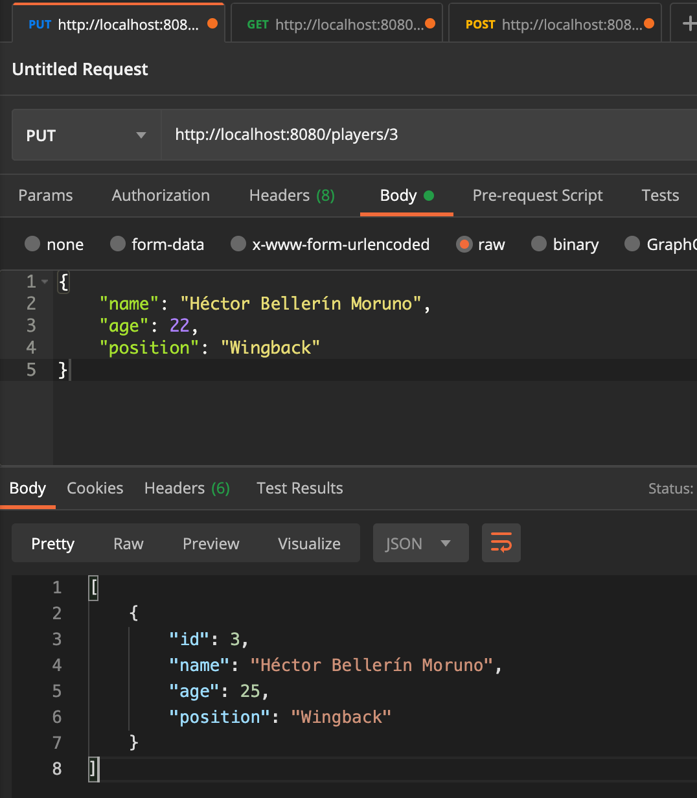

สวัสดีครับ วันนี้ขอนำเสนอบทความเกี่ยวกับการใช้ Node.js และ Typescript เพื่อสร้าง Rest API นะครับ เนื่องจากว่าได้รับมอบหมายให้ใช้ Typescript ทำโปรเจ็คขึ้นมาตัวนึง เลยคิดว่าเขียน blog ไว้ด้วยเลยดีกว่า ภาพรวมก็จะคล้าย ๆ กับ [บทความก่อนหน้า](https://xeusteerapat.github.io/blog/node-sequelize-rest-api) แต่ว่าคราวนี้ผมเปลี่ยนไปใช้ ORM อีกตัวนึงนั่นก็คือ [TypeORM](https://typeorm.io/#/) สาเหตุที่ไม่ได้ใช้ Sequelize เหมือนครั้งก่อนเพราะว่าตัวอย่างใน Doc ของ Sequlize ที่ใช้ Typescript มีน้อยมากกก (อ่านดูแล้วไม่ได้ช่วยอะไรใดๆ เลย 555555) แล้วทีนี้ลองมาศึก TypeORM ดู พบว่าเค้าเขียนเพื่อรองรับกับ Typescript โดยเฉพาะเลย อีกทั้งการทำ CRUD ก็คล้ายๆ กับวิธีการของ Sequelize ดังนั้นก็เลยเปลี่ยนมาใช้ TypeORM ครับ

[Github Repo](https://github.com/xeusteerapat/node-typeorm-crud)

## What is Typescript?

Typescript เป็น super set ของ Javascript นั่นหมายความว่าทุกอย่างที่ Javascript เขียนได้ ก็สามารถเขียนใน Typescript ได้เช่นกัน แล้วมันต่างจาก Javascript ยังไง? เรารู้กันอยู่แล้วว่า Javascript เป็น Dynamic Typed คือไม่ต้องประกาศว่าเป็น number, string, boolean บลาๆๆๆ แต่ Typescript นั้นเป็น Static Typed ทำให้เราสามารถเขียน Javascript ได้โดยมี type กำกับ และสุดท้าย Typescript ก็จะถูก compile ให้กลายเป็น Javascript ธรรมดาเพื่อให้ใช้งานได้ใน browser ทั่วไปครับ

บทความนี้ผมเขียนโดยใช้ Typescript ก็จริงแต่ว่าจะไม่ได้เน้นการใช้ Features ที่ advance มากนัก เพราะผมเองก็เพิ่งหัดเขียน Typescript ได้ไม่นานเท่าไหร่ สำหรับคนที่มีพื้นฐาน Javascript อยู่แล้วก็สามารถทำตามได้อย่างไม่ยากครับ

เริ่มกันเลยครับ

## Project Setup

ใครที่ยังไม่ลง Typescript ก็สามรถติดตั้งได้ผ่าน `npm` ครับ

```bash
npm install -g typescript ts-node
```

ทีนี้ลองเช็คดูว่าติดตั้งเรียบร้อยดีมั้ยโดยพิมพ์

```bash
tsc -h
```

ขึ้นแบบรูปข้างล่างก็โอเคครับ


คราวนี้ก็สร้างโฟลเดอร์ขึ้นมา

```bash
mkdir node-typescript-rest-api && cd node-typescript-rest-api
```

Initialize package โดยใช้คำสั่ง

```bash
npm init -y
```

จากนั้นก็ install dependencies ดังต่อไปนี้

```bash
npm install express body-parser mysql2 reflect-metadata typeorm --save
```

ทีนี้ install devDependencies คือ typescript และ nodemon

```bash
npm install -D typescript nodemon
```

เนื่องจากว่าเราจะใช้ Typescript ในการเขียนใช่มั้ยครับ โดย Typescript จะช่วยในการตรวจสอบ type ของตัวแปรต่างๆภายใน code ที่เราเขียน รวมไปถึง type ของ Library ที่เราจะนำมาใช้ด้วย แต่ว่า Libray ส่วนมากถูกเขียนขึ้นมาจาก Javascript เป็นหลัก ดังนั้นเราจำเป็นต้องติดตั้ง package เสริมคือ [**Definitely Typed**](http://definitelytyped.org/) เพื่อให้ Typescript ทำงานกับ Library ที่เราใช้งานได้อย่างเต็มความสามารถ โดยติดตั้ง package ดังต่อไปนี้

```bash
npm install -D @types/express @types/body-parser
```

คราวนี้ต้องมาตั้งค่า configuration file ของ Typescript กันก่อนโดยสร้างไฟล์ `tsconfig.json` ขึ้นมาเพื่อเป็นการบอก typescript compiler ว่าจะต้องจัดการกับไฟล์ `.ts` ในโปรเจ็คอย่างไรบ้าง ที่จริงมันมีรายละเอียดการตั้งค่าเยอะมาก แต่ในที่นี้ผมตั้งค่าตาม Document ของ TypeORM เป็นหลักนะครับ

```json
// tsconfig.json
{
  "compilerOptions": {
    "lib": ["es5", "es6", "dom"],
    "target": "es5",
    "module": "commonjs",
    "moduleResolution": "node",
    "emitDecoratorMetadata": true,
    "experimentalDecorators": true
  }
}
```

จากนั้นก็สร้างไฟล์ `ormconfig.json` ขึ้นมาเพื่อควบคุมการทำงานของ TypeORM

```json
// ormconfig.json
{
  "type": "mysql",
  "host": "localhost",
  "port": 3306,
  "username": "YOUR_USERNAME",
  "password": "YOUR_PASSWORD",
  "database": "YOUR_DATABASE_NAME",
  "entities": ["src/entity/*.ts"],
  "logging": true,
  "synchronize": true
}
```

จากนั้นก็ไปสร้าง database ไว้ที่ mysql ครับ โดยใช้คำสั่งพิมพ์ลงไปที่ terminal (หรือใครจะสร้างด้วยวิธีอื่นก็ได้นะ)

```bash
mysql> create database rest_api_typescript;
mysql> use rest_api_typescript;
```

เกือบลืม สร้าง Folder structure แบบนี้นะครับ



เท่านี้ก็ติดตั้งทุกอย่างเสร็จหมดละครับบบ มาเริ่มเขียน code กันเลย

## Create Express Server

สร้าง Server เพื่อเริ่มต้นการทำงาน application ได้ดังนี้

```typescript
// index.ts
import * as express from 'express';
import { Application } from 'express';
import * as bodyParser from 'body-parser';
import { createConnection } from 'typeorm';
import playerRouter from './routes/player';

createConnection().then(connection => {
  const app: Application = express();
  app.use(bodyParser.json());

  app.use('/players', playerRouter);

  app.listen(8080, () => {
    console.log(`🔥🔥🔥 Server is listening on port 8080 🔥🔥🔥`);
  });
});
```

และสร้าง route สำหรับ player แบบนี้

```typescript
// routes/player.ts
import * as express from 'express';
import { Router, Request, Response } from 'express';

const router: Router = express.Router();

router.get('/', (req: Request, res: Response) => {
  res.send(`
    <h1>Get all players</h1>
  `);
});

export default router;
```

ลอง run app ดูครับ ด้วยคำสั่ง

```bash
npm start
```

ถ้าได้แบบในรูปก็ถือว่าสำเร็จครับ


## Create Model Entity

ขั้นตอนต่อไปก็มาทำการสร้าง Player entity เก็บข้อมูลนักฟุตบอล ซึ่งก็คือ table ใน database ของเรานั่นเอง ในที่นี้ผมจะเก็บข้อมูลดังนี้

- `id` เป็น number
- `name` เป็น string
- `age` เป็น number
- `position` เป็น string

เมื่อนำมาเขียนตาม Document ของ TypeORM ก็จะได้แบบนี้ครับ

```typescript
// entity/Player.ts
import { Entity, Column, PrimaryGeneratedColumn } from 'typeorm';

@Entity()
export class Player {
  @PrimaryGeneratedColumn()
  id: number;

  @Column()
  name: string;

  @Column()
  age: number;

  @Column()
  position: string;
}
```

Entity เปรียบเสมือนตารางเก็บข้อมูล โดยตามที่ผมเขียนไว้ข้างบนก็ตรงไปตรงมาครับว่า ข้อมูลของแต่ละ `Column` คือ id, name, age และ position ของนักฟุตบอล โดยที่มี `id` เป็น `PrimaryGeneratedColumn` นั่นเอง

## Create Player

ต่อไปเราก็สร้างข้อมูลโดยเขียนคำสั่งใน controllers แบบนี้

```typescript
// controllers/player.ts
import { getRepository } from 'typeorm';
import { Request, Response } from 'express';
import { Player } from '../entity/Player';

export const createPlayer = async (req: Request, res: Response) => {
  let player = new Player();
  player = { ...req.body };

  const playerRepository = getRepository(Player);

  await playerRepository.save(player);
  res.send(player);
};
```

จากนั้นกลับไปแก้ player route ก่อนนะครับ

```typescript
// routes/player.ts
import * as express from 'express';
import { Router } from 'express';
import { createPlayer } from '../controllers/player';

const router: Router = express.Router();

router.post('/', createPlayer);

export default router;
```

จากนั้นก็ใช้ Postman ทำการ `POST request` ไปที่ `http://localhost:8080` เพื่อเพิ่มข้อมูลของนักฟุตบอลลงไป แล้วลองยิงดู


ลองเพิ่มอีกสัก 2-3 คนนะครับ แล้วไปเช็คที่ database ดู


เรียบร้อยยยย สังเกตว่า `id` ถูกเพิ่มให้อัตโนมัติเลยครับ

## Get players

อยากเรียกดู players ทั้งหมดที่สร้างไว้ ก็ทำแบบนี้

```typescript
// controllers/player.ts
export const getAllPlayers = async (req: Request, res: Response) => {
  const playerRepository = getRepository(Player);

  const players = await playerRepository.find();
  res.send(players);
};
```

แล้วไปเพิ่ม ที่ `routes/player.ts` แบบนี้

```typescript
// routes/player.ts
import { createPlayer, getAllPlayers } from '../controllers/player';

router.get('/', getAllPlayers);
```

จากนั้นก็ลอง Test ที่ Postman เหมือนเดิมด้วย GET method


## Update player

ถ้าอยากแก้่ไขข้อมูลของนักเตะตาม `id` ก็ทำได้โดยดึงข้อมูลตาม `id` ที่ต้องการแก้ไขออกมาก่อน จากนั้นค่อยทำการ update อีกที

```typescript
// controllers/player.ts
export const updatePlayerById = async (req: Request, res: Response) => {
  const { name, position } = req.body;
  const playerRepository = getRepository(Player);

  await playerRepository.update(Number(req.params.id), {
    name,
    position
  });

  const updatedPlayer = await playerRepository.find({
    id: Number(req.params.id)
  });

  res.send(updatedPlayer);
};
```

แล้วก็แก้ไขที่ `routes/player.ts`

```typescript
// routes/player.ts
import {
  createPlayer,
  getAllPlayers,
  updatePlayerById
} from '../controllers/player';

router.put('/:id', updatePlayerById);
```

ทดสอบที่ Postman และลองเช็คที่ database ดู




ก็เป็นไปตามที่แก้ไขครับ

## Delete player

สุดท้าย ถ้าอยาก delete ก็ทำคล้ายๆ update เลยครับ หาจาก `id` ก่อนจากนั้นก็ค่อยทำการลบออกไป

```typescript
// controllers/player.ts
export const deletePlayerById = async (req: Request, res: Response) => {
  const playerRepository = getRepository(Player);

  const player = await playerRepository.find({
    id: Number(req.params.id)
  });

  await playerRepository.remove(player);

  res.send(`Player id ${req.params.id} has been deleted.`);
};
```

แล้วก็ที่ `routes/player.ts` จะได้

```typescript
// routes/player.ts
import {
  createPlayer,
  getAllPlayers,
  updatePlayerById,
  deletePlayerById
} from '../controllers/player';

router.delete('/:id', deletePlayerById);
```

เหมือนเดิมครับบบบ ใช้ Postman


ลองเช็คดูว่าหายมั้ย


เรียบร้อยยย โดนลบไปแล้ววววว

Code ทั้งหมดของ routes และ controllers ก็จะได้เป็นแบบนี้

```typescript
// routes/player.ts
import * as express from 'express';
import { Router } from 'express';
import {
  createPlayer,
  getAllPlayers,
  updatePlayerById,
  deletePlayerById
} from '../controllers/player';

const router: Router = express.Router();

router.post('/', createPlayer);
router.get('/', getAllPlayers);
router.put('/:id', updatePlayerById);
router.delete('/:id', deletePlayerById);

export default router;
```

```typescript
// controllers/player.ts
import { getRepository } from 'typeorm';
import { Request, Response } from 'express';
import { Player } from '../entity/Player';

export const createPlayer = async (req: Request, res: Response) => {
  let player = new Player();
  player = { ...req.body };

  const playerRepository = getRepository(Player);

  await playerRepository.save(player);
  res.send(player);
};

export const getAllPlayers = async (req: Request, res: Response) => {
  const playerRepository = getRepository(Player);

  const players = await playerRepository.find();
  res.send(players);
};

export const updatePlayerById = async (req: Request, res: Response) => {
  const { name, position } = req.body;
  const playerRepository = getRepository(Player);

  await playerRepository.update(Number(req.params.id), {
    name,
    position
  });

  const updatedPlayer = await playerRepository.find({
    id: Number(req.params.id)
  });

  res.send(updatedPlayer);
};

export const deletePlayerById = async (req: Request, res: Response) => {
  const playerRepository = getRepository(Player);

  const player = await playerRepository.find({
    id: Number(req.params.id)
  });

  await playerRepository.remove(player);

  res.send(`Player id ${req.params.id} has been deleted.`);
};
```

Blog นี้ก็ขอจบเพียงเท่านี้ก่อนนะครับ หวังว่าจะเป็นประโยชน์ต่อผู้ที่สนใจทุกท่าน อาจจะไม่สมบูรณ์เท่าไหร่ เพราะผมเองก็ยังใหม่กับ Typescript แต่ก็จะพยายามฝึกฝนให้เขียนดีกว่านี้ และอธิบายได้ดีกว่านี้นะครับ Blog ต่อไปอาจจะมาเพิ่มเติมเกี่ยว User authentication ดูครับผมมม

Happy Coding :)
