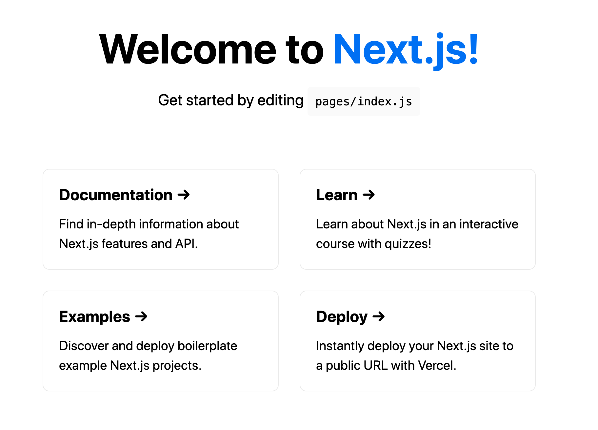

สวัสดีครับ วันนี้จะมาแนะนำการสร้าง Graphql server ใน Next.js project กัน หลายคนอาจจะสงสัยนะครับว่า อ้าว Next.js เป็น React Framework ไม่ใช่เหรอ แล้วมันเอามาทำ Graphql server ได้ยังไง ตอนแรกผมก็งงๆ แบบนี้เหมือนกัน แต่ลองไปค้นคว้าเพิ่มเติมดูพบว่า ตั้งแต่ Next.js version 9 เป็นต้นมา เราสามารถสร้าง api route ได้เองใน project ของเราเลย ซึ่งก็สามารถสร้างได้ทั้ง REST api ปกติ หรือว่า Graphql api ก็ได้เช่นกัน ทีนี้มีขั้นตอนการทำยังไง เรามาเริ่มกันเลยครับ

## Create Next.js Project

สร้าง project ขึ้นมาใหม่โดยใช้คำสั่งข้างล่างนี้

```bash
npx create-next-app nextjs-graphql-server-example
```

จากนั้นก็เข้าไปที่ project directory แล้วก็ให้มัน run โดยคำสั่ง

```bash
cd nextjs-graphql-server-example
yarn dev
```

แล้วไปที่ ```http://localhost:3000``` ก็จะเห็นหน้าตาแบบรูปข้างล่าง



## Next.js API Route intruduction

ทีนี้เราก็เปิด project ขึ้นมาด้วย text editor ผมใช้ vscode นะครับ เราก็จะเห็นโครงสร้าง folder ต่างๆ ประมาณนี้


จะเห็นได้ว่ามี folder `pages/api` อยู่ แล้วข้างในมีไฟล์ที่ชื่อว่า `hello.js` ถ้าลองเปิดดู จะเห็น code แบบนี้

```javascript
// pages/api/hello.js

// Next.js API route support: https://nextjs.org/docs/api-routes/introduction

export default (req, res) => {
  res.statusCode = 200
  res.json({ name: 'John Doe' })
}
```

ถ้าใครเคยพัฒนา application ด้วย node.js/express มาก่อน ก็ร้องอ๋อเลยทีเดียว เพราะมันคือการสร้าง express handler นั่นเอง จาก [document](https://nextjs.org/docs/api-routes/introduction) เค้าก็จะบอกว่า ถ้าเราสร้างไฟล์ไว้ข้างใน `pages/api` มันก็จะนำชื่อไฟล์มาสร้างเป็น api route ให้เราเลย ถ้าอยากรู้ว่าหน้าตา response เป็นอย่างไร ก็เข้าไปที่ `http://localhost:3000/api/hello`

```json
{
  "name": "John Doe"
}
```

## Create Graphql server

ต่อไปก็เป็นการสร้าง Graphql Server นะครับ ขั้นตอนนี้หวังว่าทุกคน พอจะมี basic graphql คร่าวๆ แล้วนะครับ เข้าใจการสร้าง type, Resolvers function อะไรพวกนี้ ก่อนอื่นก็ install dependencies เหล่านี้ก่อนครับ

```bash
npm install --save apollo-server-micro graphql swr axios
or
yarn add apollo-server-micro graphql swr axios
```

โดยที่

- `apollo-server-micro`, `graphql` สำหรับสร้าง Graphql server
- `swr`, `axios` สำหรับ fetch data จาก graphql

ทีนี้สร้างไฟล์ `graphql.js` ข้างใน `pages/api` และสร้าง Graphql server แบบนี้

```javascript
// graphql.js
import { ApolloServer, gql } from 'apollo-server-micro';

const typeDefs = gql`
  type Query {
    users: [User!]!
  }

  type User {
    firstname: String
    lastname: String
    age: Int
    occupation: String
  }
`;

const resolvers = {
  Query: {
    async users() {
      return [
        {
          firstname: "Teerapat",
          lastname: "Prommarak",
          age: 34,
          occupation: 'Software Engineer'
        },
        {
          firstname: "Mesut",
          lastname: "Ozil",
          age: 31,
          occupation: 'Professional Footballer'
        },
        {
          firstname: "Bill",
          lastname: "Gate",
          age: 65,
          occupation: 'Entrepreneur'
        },
      ]
    },
  },
};

const apolloServer = new ApolloServer({ typeDefs, resolvers });

export const config = {
  api: {
    bodyParser: false,
  },
};

export default apolloServer.createHandler({ path: '/api/graphql' });
```

จากนั้นให้เข้าไปที่ `http://localhost:3000/api/graphql` ก็จะเห็น graphql playground ทีนี้ลอง query เล่นๆ ดูครับ

```javascript
query {
  users{
    firstname
    lastname
    age
    occupation
  }
}
```

เราก็จะได้ query result ออกมาแบบนี้

```json
{
  "data": {
    "users": [
      {
        "firstname": "Teerapat",
        "lastname": "Prommarak",
        "age": 34,
        "occupation": "Software Engineer"
      },
      {
        "firstname": "Mesut",
        "lastname": "Ozil",
        "age": 31,
        "occupation": "Professional Footballer"
      },
      {
        "firstname": "Bill",
        "lastname": "Gate",
        "age": 65,
        "occupation": "Entrepreneur"
      }
    ]
  }
}
```

ความสะดวกของ graphql query ก็คือในกรณีที่มันมี field ที่เราไม่ต้องการ เราก็ไม่ต้องเลือกมัน อย่างเช่น ถ้าผมต้องการแค่ firstname และ age ผมก็เขียน query ออกมาแบบนี้

```javascript
query {
  users{
    firstname
    age
  }
}
```

response ที่ได้

```json
{
  "data": {
    "users": [
      {
        "firstname": "Teerapat",
        "age": 34
      },
      {
        "firstname": "Mesut",
        "age": 31
      },
      {
        "firstname": "Bill",
        "age": 65
      }
    ]
  }
}
```

## Working with existion API

คราวนี้ผมจะเปลี่ยนจาก mock data ข้างบนมาใช้ [brewdog punk api](https://punkapi.com/documentation/v2) ซึ่งผมต้องทำการแก้ไข `typeDefs` และ `query resolver` ก่อน โดยแก้ให้เป็นแบบนี้

```javascript
import { ApolloServer, gql } from 'apollo-server-micro';
import axios from 'axios';

const typeDefs = gql`
  type Query {
    beers: [Beer!]!
  }
  type Beer {
    id: Int
    name: String
    tagline: String
    first_brewed: String
    description: String
    image_url: String
    abv: Float
    brewers_tips: String
  }
`;

const resolvers = {
  Query: {
    async beers() {
      try {
        const res = await axios.get('https://api.punkapi.com/v2/beers');
        const beer = res.data;

        return beer;
      } catch (error) {
        throw error;
      }
    },
  },
};

const apolloServer = new ApolloServer({ typeDefs, resolvers });

export const config = {
  api: {
    bodyParser: false,
  },
};

export default apolloServer.createHandler({ path: '/api/graphql' });
```

ลองไป query ดูใน graphql playground ครับ


## Fetch data in client side

หลังจากที่ Server ของเราเสร็จเป็นที่เรียบร้อยแล้ว ทีนี้ลองมาทำให้มันแสดงผลที่ฝั่ง frontend ดูบ้างครับ ผมจะให้ library `swr` เป็นตัวช่วย fetch data จาก graphql server นะครับ เบื้องต้น `swr` เป็น react hook ที่ช่วยอำนวยความสะดวกเราในการดึงข้อมูลจาก server โดยที่เราไม่ต้องใช้ `React.useEffect` เราสามรถใช้ `swr` กับ rest api ปกติก็ได้ ไม่จำเป็นว่าต้องเป็น graphql server ซึ่ง `swr` เองมีตัวช่วยเรื่อง `caching` หรือ `pagination` ด้วย จริงมันมีอะไรมากกว่านั้นอีก สามารถศึกษาเพิ่มเติมได้ที่ [SWR](https://swr.vercel.app/) ครับ

คราวนี้เปิดไฟล์ `index.js` ขึ้นมาครับ ลบทุกอย่าง แต่ให้เหลือประมาณนี้

```jsx
import styles from '../styles/Home.module.css';
import useSWR from 'swr';

export default function Home() {
  return (
    <div className={styles.container}>
      <h1>PUNK IPA</h1>
    </div>
  );
}
```

ปกติแล้ว `useSWR` จะรับ 2 parameters เพื่อดึงข้อมูลมาจาก graphql server

- `query`
- `fetchData function`

โดยที่เขียน `query` และ `fetchData function` แบบนี้ จากนั้นลอง `console.log(data)` ออกมาดูครับ

```jsx
import styles from '../styles/Home.module.css';
import useSWR from 'swr';
import axios from 'axios';

const fetchBeer = async query => {
  const response = await axios({
    method: 'POST',
    url: '/api/graphql',
    data: JSON.stringify({ query }),
  });

  return response.data;
};

export default function Home() {
  const { data, error } = useSWR(
    `
    query {
      beers {
        id
        name
        tagline
        abv
        description
        image_url
      }
  }`,
    fetchBeer
  );

  console.log(data);

  return (
    <div>
      <h1
        className='text-5xl'
        style={{ textAlign: 'center', paddingTop: '3rem' }}
      >
        PUNK IPA
      </h1>
    </div>
  );
}
```

เราก็จะได้ข้อมูลกลับมาแบบนี้


จากนั้นใครจะ render data ยังไง หรือจะ styling ยังไง อันนี้แล้วความชอบของแต่ละคนเลยนะครับ ผมเองมีตัวอย่างที่ทำเสร็จแล้ว ลองเข้าไปดูกันได้ที่ [Brewdog PUNK IPA](https://nextjs-graphql-omega.vercel.app/) (ปล. ไม่สวยเลย ขออภัย 555555)

หวังว่าจะมีประโยชน์สำหรับใครที่กำลังศึกษาด้านนี้อยู่นะครับ โดยส่วนตัวผมค่อนข้างชอบ tools, library หรือ framework ที่ทีม developers ของ Next.js ทำออกมามาก มี product ดีๆ หลายตัวเลยทำให้เราสามารถสร้างหรือทดลองทำอะไรใหม่ๆ แล้วนำเสนอกับคนอื่นๆ ได้เร็วขึ้น สำหรับโพสต์นี้ ก็ขอจบลงเพียงเท่านี้นะครับ Happy Coding :)

## References

- [Next.js API Routes](https://nextjs.org/docs/api-routes/introduction)
- [How To Build A GraphQL Server Using Next.js API Routes](https://www.smashingmagazine.com/2020/10/graphql-server-next-javascript-api-routes/)
- [SWR](https://swr.vercel.app/)
- [Github Repo](https://github.com/xeusteerapat/nextjs-graphql)
