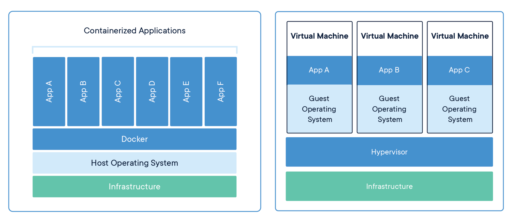
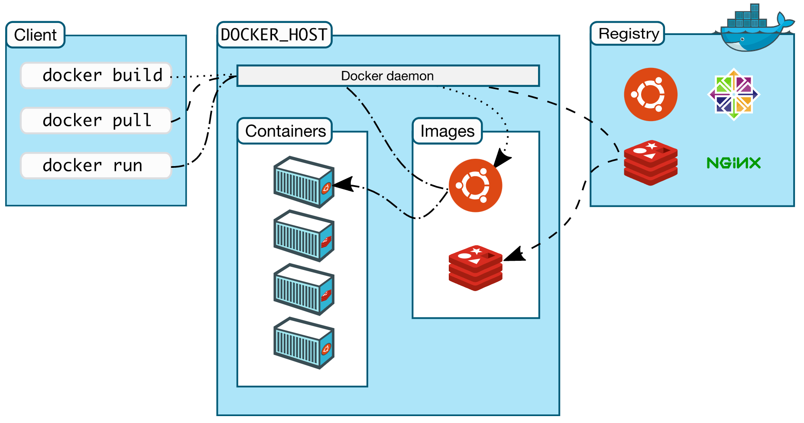

## What is Docker?

- Docker is a platform for creating and running containers.

in long version...

> *Docker is an open platform for developing, shipping, and running applications. Docker enables you to separate your applications from your infrastructure so you can deliver software quickly. With Docker, you can manage your infrastructure in the same ways you manage your applications.*
> 



- The container is an **instance** of an image that runs a program (in short)
- The container is a **process** or a set of processes that have a grouping of resources specifically assign to it
- After we installed Docker, then we automatically installed **Linux Virtual Machine**

## Docker Architecture

Docker uses a client-server architecture. Docker client talks to Docker Daemon (server) via REST API




```javascript
const container = new Image()
```

## Why use Docker

Docker helps us run software without worrying about **setup or install dependencies.**

- Install and run dependencies in minutes.
- Manage isolated applications.
- Use your favorite development tools, editors, and workflows.
- Distribute your web application to others on your team.
- Deploy your application to live production servers.

## Docker CLI

- `docker run <IMAGE_NAME>` run specific image
- `docker run <IMAGE_NAME>` command but those specific commands must be specified in the image
- docker run behind the scene is `docker create <IMAGE_NAME>` + `docker start -a <CONTAINER_ID>`
- `docker ps` list currently running containers -a for list all containers
- `docker system prune` delete all containers
- `docker logs` retrieve messages from the container
- `docker stop <CONTAINER_ID>` stop `SIGTERM` (Terminate signal) stop the process inside the container and shut the container down
- `docker kill <CONTAINER_ID>` kill `SIGKILL` immediately shutdown
- `docker exec -it <CONTAINER_ID>` execute interactive mode in container
- `docker exec -it <CONTAINER_ID> sh` execute with command processors (shell)
- If you open 2 terminal windows and run the same command ie. `docker run -it busybox sh`  then you’ll get an isolated container it means there is nothing relate between container A and B

### Create Docker Images

- `Dockerfile` is a configuration file on how the container should behave
    

    

Behind the scene

1.	Provide configuration or commands in `Dockerfile`

2.	Docker client provides the file to Docker server.

3.	Docker server will look inside the Dockerfile and build a usable image for us.

### Example building Redis image

```Dockerfile
# Use an existing docker image as a base
FROM alpine

# Download and install a dependency
RUN apk add --update redis

# Tell the image what to do when it starts as a container
CMD [ "redis-server" ]
```

in the Terminal

```shell
docker build .
```

here is output we got

```shell
[+] Building 9.4s (7/7) FINISHED
=> [internal] load build definition from Dockerfile                                                                              0.1s
=> => transferring dockerfile: 242B                                                                                              0.0s
=> [internal] load .dockerignore                                                                                                 0.1s
=> => transferring context: 2B                                                                                                   0.0s
=> [internal] load metadata for [docker.io/library/alpine:latest](http://docker.io/library/alpine:latest)                                                                  5.0s
=> [auth] library/alpine:pull token for [registry-1.docker.io](http://registry-1.docker.io/)                                                                     0.0s
=> [1/2] FROM [docker.io/library/alpine@sha256:eb3e4e175ba6d212ba1d6e04fc0782916c08e1c9d7b45892e9796141b1d379ae](http://docker.io/library/alpine@sha256:eb3e4e175ba6d212ba1d6e04fc0782916c08e1c9d7b45892e9796141b1d379ae)                   1.8s
=> => resolve [docker.io/library/alpine@sha256:eb3e4e175ba6d212ba1d6e04fc0782916c08e1c9d7b45892e9796141b1d379ae](http://docker.io/library/alpine@sha256:eb3e4e175ba6d212ba1d6e04fc0782916c08e1c9d7b45892e9796141b1d379ae)                   0.0s
=> => sha256:eb3e4e175ba6d212ba1d6e04fc0782916c08e1c9d7b45892e9796141b1d379ae 1.64kB / 1.64kB                                    0.0s
=> => sha256:be9bdc0ef8e96dbc428dc189b31e2e3b05523d96d12ed627c37aa2936653258c 528B / 528B                                        0.0s
=> => sha256:021b3423115ff662225e83d7e2606475217de7b55fde83ce3447a54019a77aa2 1.47kB / 1.47kB                                    0.0s
=> => sha256:29291e31a76a7e560b9b7ad3cada56e8c18d50a96cca8a2573e4f4689d7aca77 2.81MB / 2.81MB                                    1.4s
=> => extracting sha256:29291e31a76a7e560b9b7ad3cada56e8c18d50a96cca8a2573e4f4689d7aca77                                         0.3s
=> [2/2] RUN apk add --update redis                                                                                              2.2s
=> exporting to image                                                                                                            0.1s
=> => exporting layers                                                                                                           0.1s
=> => writing image sha256:7be6457499ed65fa0dc5189563201329a73fcdeda144ca49ba669671b80f296a
```

Actually `7be6457499ed` is enough to run the container, then run 

```shell
docker run 7be6457499ed
```

open another terminal window and run `redis-cli` then you can access your own Redis image you built.

### `Dockerfile` in details

1. `FROM` specify Docker image we want to use as base image. In this case is used the `alpine` Linux as a base image which means, this image already has pre-installed some programs.
2. `RUN` execute some commands while we are preparing the image
3. `CMD` command instruction to run when the image is used to start up the container

all above are the most commonly used in `Dockerfile`

### `docker build` command

Take the `Dockerfile` and build an image with it `.` is a **build context.** In **t**his case, we've used the current directory to build the image.

### Building the image with tag

```shell
docker build -t DOCKER_USERNAME/YOUR_IMAGE_NAME:version
```

- docker username
- image name
- version (lastest)

then you can run 

```shell
docker run DOCKER_USERNAME/YOUR_IMAGE_NAME:version
```

### Create a simple Node.js web application

Here is the project folder structure


Here is `package.json`

```json
{
  "name": "nodejs-simple-web",
  "version": "1.0.0",
  "description": "",
  "main": "index.js",
  "scripts": {
    "start": "node index.js"
  },
  "keywords": [],
  "author": "",
  "license": "ISC",
  "dependencies": {
    "express": "^4.17.1"
  }
}
```

Let's create simple Node.js server and serve some content

```javascript
const express = require('express');
const app = express();

app.get('/', (req, res) => {
  res.send(`
    <h1>Hi, I'm running in Docker</h1>
  `);
});

app.listen(8080, () => {
  console.log('server start on port 8080 🚀');
});
```

Let's create the `Dockerfile`

```Dockerfile
FROM node:alpine

WORKDIR /usr/app

COPY ./ ./

RUN npm install

CMD ["npm", "start"]
```

Here are steps by steps explanations

1. use base `node:alpine` base image.
2. Define `/user/app` as a working directory inside the container.
3. Copy everything inside our current directory to the working directory (as above `/usr/app` is a relative directory to `./`
4. Run command when the container has started.
5. Run `npm start` command to start the application.
6. In our terminal, run 

```shell
docker build . -t xeusteerapat/nodejs-simple-web
```

then run the container

```shell
docker run -p 8080:8080 xeusteerapat/nodejs-simple-web
```

Let's visit [`http://localhost:8080`](http://localhost:8080/) in the web browser then you should see something like the picture below


## Managing multiple local containers using Docker compose

Imagine we create a Node.js application to receive the request and counting the number of visitors by saving data to the Redis. Normally, we'll never use Docker CLI to manage multiple containers in this case. Instead, we'll use **Docker Compose**

**Docker Compose** is a tool for defining and running multi-container Docker applications. By creating a `docker-compose.yml` file to configure your application’s services.

Here is Node.js application

```javascript
const express = require('express');
const redis = require('redis');

const app = express();
const redisClient = redis.createClient({
  host: 'redis-server',
  port: 6379,
});

redisClient.set('visits', 0);

app.get('/', (req, res) => {
  redisClient.get('visits', (err, visits) => {
    if (err) {
      throw new Error('Something wrong');
    }

    res.send(`
      <h1>Number of visitors is: ${visits}</h1>
    `);

    redisClient.set('visits', Number(visits) + 1);
  });
});

app.listen(8081, () => console.log('server running on port 8081'));
```

Then create `Dockerfile` to build Node.js app image

```Dockerfile
FROM node:alpine

WORKDIR '/app'

COPY package.json .

RUN npm install

COPY . .

CMD ["npm", "start"]
```

then create `docker-compose.yml` in the root directory.

```yaml
version: '3'
services: # type of containers
  redis-server:
    image: 'redis' # using redis image
  node-app:
		restart: always # restart policy
    build: . # look in current dir and build
    ports: 
      - "4001":"8081" # our port in local machine map to container port
```

after that, in terminal run 

```shell
docker-compose up
```

and there we go, our containers are running.


Let's visit [`http://localhost:4001/`](http://localhost:4001/) you'll see


If we want to stop all containers, we'll run a command

```shell
docker-compose down
```

## Resources

- [https://www.udemy.com/course/docker-and-kubernetes-the-complete-guide/](https://www.udemy.com/course/docker-and-kubernetes-the-complete-guide/)
- [https://docs.docker.com/engine/faq/](https://docs.docker.com/engine/faq/)
- [https://stackoverflow.com/questions/16047306/how-is-docker-different-from-a-virtual-machine](https://stackoverflow.com/questions/16047306/how-is-docker-different-from-a-virtual-machine)
- [https://www.bmc.com/blogs/docker-101-introduction/](https://www.bmc.com/blogs/docker-101-introduction/)
- [https://medium.com/i-gear-geek/docker-คือ-เริ่มต้นกับ-docker-56d0ba499ae8](https://medium.com/i-gear-geek/docker-%E0%B8%84%E0%B8%B7%E0%B8%AD-%E0%B9%80%E0%B8%A3%E0%B8%B4%E0%B9%88%E0%B8%A1%E0%B8%95%E0%B9%89%E0%B8%99%E0%B8%81%E0%B8%B1%E0%B8%9A-docker-56d0ba499ae8)
- [https://www.youtube.com/watch?v=tPMk5UCvucM](https://www.youtube.com/watch?v=tPMk5UCvucM)
- [https://docker-curriculum.com/#introduction](https://docker-curriculum.com/#introduction)
- [https://devopswithdocker.com/part1/](https://devopswithdocker.com/part1/)
- [https://code.coursesity.com/docker-interview-questions](https://code.coursesity.com/docker-interview-questions)